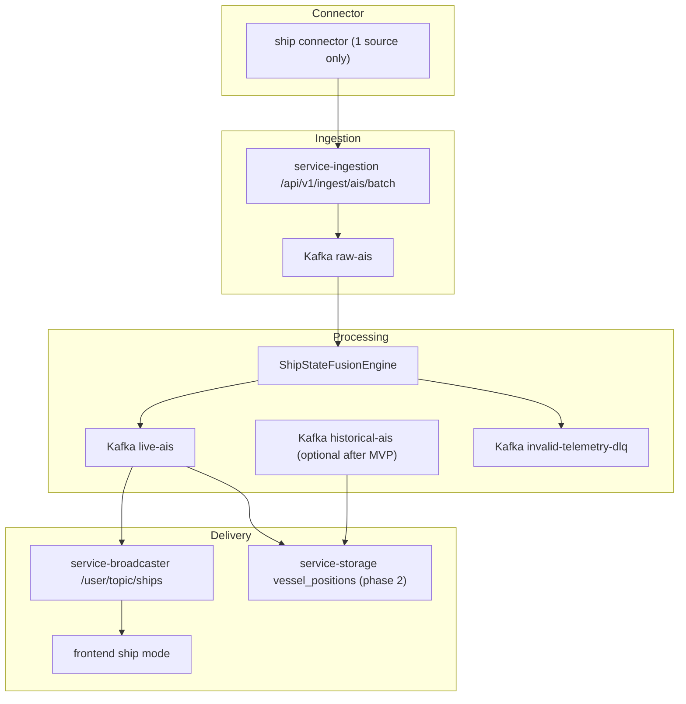

# Ship Tracking Implementation Plan - Senior Review

## Executive Summary

Plan goc co huong dung o 3 diem:
- Tach rieng aircraft va ship theo pipeline.
- Tach WS/topic theo tracking mode de tranh push du lieu thua.
- Di theo phase thay vi sua toan bo he thong mot lan.

Tuy nhien plan goc van co 5 van de lon:
- Scope phase 1 qua rong, tron business scope voi refactor scope.
- Co mot so chi tiet lech voi codebase hien tai.
- Chua tach ro "position stream" va "vessel profile/static data".
- Chua co acceptance gate va rollback strategy cho tung phase.
- Chua xu ly ro rui ro nguon du lieu AIS: licensing, rate limit, quality, duplicate across providers.

Tai lieu nay thay the ban plan cu bang mot plan da duoc review duoi goc nhin senior dev: giam rui ro, bam sat code hien tai, va co duong rollout thuc te hon.

---

## Senior Review

### Diem manh cua plan goc

- Chon huong tach pipeline theo topic (`raw/live/historical`) la dung. Cach nay giu aircraft path on dinh.
- Y tuong UI co `tracking mode` la hop ly. Neu mode la mutually-exclusive thi ta tranh load va render 2 domain cung luc.
- Da nghi den storage, processing, broadcaster, frontend va connectors ngay tu dau. Dieu nay tot cho phan system thinking.
- Da dua ra dependency order theo phase. Day la nen tang tot de bien thanh execution plan.

### Diem yeu can sua

#### 1. DTO cho ship dang qua to o raw stage

`CanonicalShip` trong ban cu nhan qua nhieu field profile nhu `owner`, `manager`, `classification`, `grossTonnage`, `deadweight`, `homePort`.

Van de:
- Day khong phai deu la telemetry.
- Nguon AIS dynamic va static message khong cung tan suat.
- Ghi lai cac field profile vao moi position row se tang storage cost, tang duplicate, va lam processing nang hon can thiet.

Huong sua:
- Phase 1 chi cho phep `CanonicalShip` chua dynamic fields + mot it static fields thuc su can cho UI.
- Dua vessel profile vao `ShipMetadata` hoac bang `vessel_profiles` rieng o phase sau.

#### 2. Plan dang lech voi codebase hien tai o mot so cho quan trong

- `GatewayRoutesConfig` hien tai da route `/api/v1/ingest/**`, khong can sua rieng cho AIS path.
- Broadcaster hien tai push bang `convertAndSendToUser(..., "/topic/flights")`, client moi subscribe `/user/topic/flights`.
  Nghia la ship path nen mirror thanh:
  - server destination: `/topic/ships`
  - client subscription: `/user/topic/ships`
- Storage hien tai dung `JdbcBatchWriter`, `StorageConsumerWorker`, `PersistableFlight`, `flight_positions`.
  Plan cu goi ten class moi chua bam theo abstraction thuc te.
- Processing abstractions hien tai dang rat flight-specific:
  - `DedupKeyService`
  - `LastKnownStateStore`
  - `KinematicValidator`
  - `InvalidFlightRecord`
  Day la canh bao rang scope ship se can duplicate mot so class hoac refactor abstraction co chu dich, khong the "chi them topic" la xong.

#### 3. Chua co chien luoc DLQ/quarantine cho ship

Plan cu them `raw-ais/live-ais/historical-ais` nhung bo trong:
- malformed ship payload di dau?
- key mismatch `mmsi` xu ly the nao?
- ship kinematic invalid se vao contract nao?

Huong sua:
- Phase 1 tiep tuc tai su dung `invalid-telemetry-dlq`, nhung can tao contract rieng `InvalidShipRecord`.
- Storage quarantine can ho tro ca `mmsi` thay vi chi `icao`, hoac chuyen ve schema trung lap domain-neutral.

#### 4. Chua co mo hinh cho multi-source merge

Voi ship, duplicate cross-provider la chuyen chac chan xay ra.
Neu 4 connector cung day cung mot vessel:
- cung `mmsi`
- event time xap xi
- lat/lon lech nho
- quality score khac nhau

Neu khong co source precedence rule, processing se:
- publish duplicate len UI
- ghi duplicate vao storage
- lam sai trail/history

Huong sua:
- Dinh nghia source precedence ngay trong processing.
- Cho phep dedup theo `mmsi + rounded(lat/lon) + time bucket` neu source quality thap.
- Phase 1 chi support 1 source that su. Phase sau moi bat multi-source fusion.

#### 5. Chua co pham vi "minimum viable ship tracking"

Plan cu muon lam ca:
- 4-5 connectors
- enrichment image
- frontend toggle
- storage
- websocket isolation
- profile metadata day du

Day la qua nhieu cho increment dau tien.

Huong sua:
- MVP chi can:
  - 1 connector
  - 1 ingest path
  - 1 processing path
  - 1 live WS path
  - 1 ship layer co marker co ban
  - optional storage, neu can cho trail/history thi them sau

---

## Planning Principles

Plan moi tuan theo 6 nguyen tac:

1. Khong refactor tong quat neu chua can.
2. Khong dua `TrackingMode` vao `common-dto` neu no chi phuc vu frontend/broadcaster.
3. Position data va vessel profile la 2 concern khac nhau.
4. Multi-source la phase sau, khong lam cung luc voi domain bring-up.
5. Moi phase phai co acceptance gate, rollback path, va metric theo doi.
6. Feature phai co `disabled-by-default` cho den khi E2E pass.

7. Moi thay doi tinh nang (ke ca UX/frontend panel) phai cap nhat lai execution checklist de tranh lech giua code va plan.

---

## Revised Target Scope

### Muc tieu business cua MVP

Cho phep user chuyen map sang `ship` mode va nhan duoc live vessel markers trong viewport, khong anh huong aircraft mode.

### Out of scope cho MVP

- 4-5 ship connectors cung luc
- image enrichment
- vessel profile day du
- complex route/trail analytics
- cross-source fusion nang
- historical playback cho ship

Nhung muc nay chi nen bat dau sau khi live ship path on dinh.

---

## Revised Architecture

Key change so voi plan cu:
- `historical-ais` la optional o giai doan dau, khong ep phai co ngay.
- storage khong phai blocker cho live WS MVP.
- chi 1 connector cho increment dau tien.

---

## Data Contract Proposal

### 1. Raw telemetry contract: `CanonicalShip`

Khuyen nghi chi gom:
- `mmsi: String`
- `lat: Double`
- `lon: Double`
- `speed: Double?`
- `course: Double?`
- `heading: Double?`
- `navStatus: String?`
- `vesselName: String?`
- `vesselType: String?`
- `imo: String?`
- `callSign: String?`
- `destination: String?`
- `eta: Long?`
- `eventTime: Long`
- `sourceId: String`
- `score: Double?`

Khong dua vao raw contract o phase dau:
- `owner`
- `manager`
- `classification`
- `grossTonnage`
- `deadweight`
- `homePort`
- `yearBuilt`

Ly do:
- khong phuc vu live map MVP
- thuong den tu enrichment/profile source
- de duplicate o storage

### 2. Enriched contract: `EnrichedShip`

Nen mirror `EnrichedFlight`:
- toan bo field cua `CanonicalShip`
- `isHistorical: Boolean`
- `metadata: ShipMetadata?`

### 3. Metadata contract: `ShipMetadata`

Cho MVP:
- `flagCountry: String?`
- `flagUrl: String?`
- `shipTypeName: String?`
- `isMilitary: Boolean = false`

`imageUrl` nen de phase sau.

### 4. Live WS contract: `LiveShipMessage`

Mirror `LiveFlightMessage`:
- `sentAt: Long`
- `ship: EnrichedShip`

### 5. Tracking mode

Khong khuyen nghi dua `TrackingMode` vao `common-dto` o phase dau.

Ly do:
- day khong phai data contract giua services qua Kafka
- chi la concern cua frontend va broadcaster session state
- dua vao `common-dto` lam mo rong public/shared API som hon can thiet

Nen dat:
- `frontend-ui`: type `TrackingMode = "aircraft" | "ship"`
- `service-broadcaster`: enum/noi bo `TrackingMode`

---

## Module-by-Module Review and Corrections

### 1. `common-dto`

Danh gia:
- Can them ship DTOs.
- Khong can them `TrackingMode` vao shared DTO module o phase dau.

Can bo sung:
- serialization tests cho snake_case/camelCase aliases
- ro rang field bat buoc va optional
- comment ngan o doc nêu `sourceId` thay vi `source`

Quyet dinh senior:
- Them `CanonicalShip`, `EnrichedShip`, `ShipMetadata`, `LiveShipMessage`
- Khong them `TrackingMode` vao module nay

### 2. Kafka topics

Danh gia:
- `raw-ais`, `live-ais` can co.
- `historical-ais` chi nen tao khi processing/storage that su can.

Can bo sung:
- partition count/keying strategy cho `mmsi`
- retention cho `raw-ais` vs `live-ais`
- contract doc update trong [docs/topic-contracts.md](/C:/Users/NamP7/Documents/workspace/2026/tracking-2026/docs/topic-contracts.md)

Khuyen nghi:
- MVP:
  - `raw-ais`
  - `live-ais`
- Phase 2:
  - `historical-ais`

### 3. `service-ingestion`

Danh gia:
- Can them ingest request va validator rieng cho AIS.
- Khong can sua `GatewayRoutesConfig` chi de mo AIS path, vi `/api/v1/ingest/**` da duoc cover.

Can bo sung:
- shutdown hook cho `RawAisProducer` giong `RawAdsbProducer`
- producer metric labels theo `sourceId`
- key strategy = `mmsi`
- strict validation:
  - `mmsi` 9 digits
  - `lat/lon` valid
  - `event_time > 0`
  - `speed/course/heading` finite

Quyet dinh senior:
- Them controller/handler cho:
  - `POST /api/v1/ingest/ais`
  - `POST /api/v1/ingest/ais/batch`
- Reuse tracing, API key filter, admission control, and backpressure pattern
- Khong sua gateway route config cho feature nay, trừ khi sau do co requirement security chi tiet hon

### 4. `service-processing`

Danh gia:
- Day la module co rui ro nhat vi code hien tai flight-specific.
- Khong nen generic hoa tat ca ngay luc dau.

Can bo sung:
- `ShipStateFusionEngine`
- `RawAisConsumer`
- `ShipTopicRouter`
- `ShipKinematicValidator`
- `ShipLastKnownStateStore`
- `InvalidShipRecord`

Can quyet dinh ro:
- ship speed threshold dung don vi gi
- stale/historical cutoff bao lau
- precedence khi 2 source day cung `mmsi`

Quyet dinh senior:
- Duplicate business classes theo domain trong increment dau, khong ep generic abstraction som.
- Reuse shared infra:
  - ObjectMapper
  - Kafka listener config pattern
  - tracing
  - metrics style

### 5. `service-storage`

Danh gia:
- Plan cu co y dung, nhung thieu 2 quyet dinh lon:
  - co can storage trong MVP khong?
  - neu can, co tach `vessel_profiles` khong?

Can bo sung:
- bang `vessel_positions`
- co the them `vessel_profiles` o phase sau
- ship-specific persistable model thay vi co gang chen vao `PersistableFlight`
- ship quarantine key (`mmsi`) thay vi `icao`

Khuyen nghi senior:
- Neu muc tieu dau tien chi la live map, storage co the lui sang phase 2.
- Neu van can storage o MVP, chi persist position fields + metadata JSONB gon nhe.
- Indexing:
  - unique dedup: `(mmsi, event_time, lat, lon)`
  - lookup: `(mmsi, event_time desc)`
  - khong nen rely chi vao index `(latitude, longitude)` cho spatial query nang; neu can query map tu DB thi tinh PostGIS/geo index o phase sau

### 6. `service-broadcaster`

Danh gia:
- Y tuong tach session theo mode la dung.
- Plan cu can chinh lai exact destination semantics cho dung voi code.

Can bo sung:
- server destination ship: `/topic/ships`
- client subscribe ship: `/user/topic/ships`
- viewport session can luu `trackingMode`
- cleanup stale session khong bi leak mode state

Quyet dinh senior:
- Them `trackingMode` vao `ViewportSession`/registry state
- `ViewportMessageHandler` danh dau `AIRCRAFT`
- them ship handler de danh dau `SHIP`
- `ShipSpatialPushEngine` chi push cho session ship mode

### 7. `connectors`

Danh gia:
- Day la phan rui ro nhat ve van hanh va phap ly.
- Khong nen commitment 4-5 connectors khi chua xac minh:
  - licensing
  - request budget
  - anti-bot / scraping restrictions
  - payload stability

Can bo sung:
- chon 1 source hop phap, on dinh, co test fixture
- adapter contract cho ship connector
- test parser voi payload captured
- rate limit, retry, jitter, timeout khac voi aircraft neu can

Quyet dinh senior:
- Phase 1 chi 1 connector
- Chi mo rong them source sau khi:
  - contract du lieu on dinh
  - processing rules ro
  - duplicate policy co test

### 8. `frontend-ui`

Danh gia:
- mode toggle la dung, nhung de user experience on dinh can them feature flag va empty/loading states.

Can bo sung:
- feature flag `shipTrackingEnabled`
- clear ref store khi doi mode
- khong mount flight socket khi o ship mode
- ship layer icon/style co ban
- test cho mode switch:
  - clear state
  - reconnect socket
  - khong render cross-domain data

Quyet dinh senior:
- UI ship mode chi hien marker + popup co ban trong MVP
- trail/history/filter nâng cao de phase sau

---

## Missing Cross-Cutting Concerns

Plan cu chua bao phu du cac muc duoi day. Day la nhung muc bat buoc phai them vao tai lieu.

### 1. Feature flag va rollout

Can co:
- backend config de bat/tat consumer/WS ship path
- frontend flag de an mode toggle khi feature chua san sang

### 2. Observability

Can co metric rieng cho ship:
- ingest accepted/rejected by source
- processing published/dropped/kinematic-invalid
- broadcaster pushed/session count by mode
- connector fetch errors, parse errors, accepted records

Can co logs/cohort:
- `sourceId`
- `mmsi`
- `requestId`
- `traceparent`

### 3. Security

Can xac minh:
- AIS ingest dung chung API key policy voi ADS-B
- request size limit co phu hop payload ship khong
- tuyet doi khong log raw credential/source secrets

### 4. Schema and contract governance

Can update:
- [docs/topic-contracts.md](/C:/Users/NamP7/Documents/workspace/2026/tracking-2026/docs/topic-contracts.md)
- docs/runbook neu co service/connector moi
- infra/env templates cho connector moi

### 5. Rollback strategy

Moi phase can rollback doc lap:
- tat connector
- tat consumer ship
- an UI toggle
- giu aircraft path khong anh huong

---

## Revised Delivery Plan

### Phase 0 - Design Lock

Deliverables:
- chot 1 ship source dau tien
- chot `CanonicalShip` contract toi gian
- chot topic names
- chot acceptance criteria cho MVP

Gate:
- team dong y source dau vao hop phap va on dinh
- contract duoc document trong `docs/topic-contracts.md`

### Phase 1 - Ingest + Processing + WS MVP

Deliverables:
- `CanonicalShip`, `EnrichedShip`, `ShipMetadata`, `LiveShipMessage`
- `raw-ais`, `live-ais`
- AIS ingest endpoint
- `RawAisProducer`
- `RawAisConsumer`
- `ShipStateFusionEngine`
- `ShipSpatialPushEngine`
- `ShipViewportMessageHandler`
- frontend mode toggle + ship socket + basic markers

Out of scope:
- storage
- historical topics
- multiple connectors
- rich metadata/profile

Gate:
- ship data vao UI qua WS
- aircraft mode khong bi regression
- ship mode khong load aircraft socket/data

### Phase 2 - Storage + History Foundation

Deliverables:
- `vessel_positions`
- `ShipStorageConsumerWorker`
- `ShipJdbcBatchWriter`
- optional `historical-ais`

Gate:
- idempotent writes pass
- query back 1 vessel history duoc

### Phase 3 - Source Expansion

Deliverables:
- them source thu 2
- source precedence policy
- duplicate cross-source tests

Gate:
- khong double-push tren UI
- khong duplicate storage vuot nguong chap nhan

### Phase 4 - Profile Enrichment and UX

Deliverables:
- `vessel_profiles` neu can
- richer popup/details
- ship trail/history tren UI

---

## Test Strategy

### Unit tests bat buoc

- `common-dto`
  - serialization/deserialization cho ship DTOs
- `service-ingestion`
  - validator MMSI
  - batch limits
  - source header precedence
- `service-processing`
  - dedup
  - key mismatch
  - kinematic invalid
  - out-of-order -> historical/live routing
- `service-broadcaster`
  - mode-aware session registry
  - ship viewport routing
  - khong push ship vao aircraft session
- `frontend-ui`
  - mode switch clears stores
  - ship socket subscribe/unsubscribe
  - ship layer transform
- `connectors`
  - parser fixtures
  - MMSI normalization
  - retry/rate-limit handling

### Integration tests bat buoc

- ingest AIS -> raw-ais
- raw-ais -> processing -> live-ais
- live-ais -> broadcaster WS -> frontend client test
- aircraft va ship sessions song song, moi session chi nhan dung data domain cua minh

### Tests chua nen bo qua

- dirty payload / malformed JSON
- key mismatch (`record.key != mmsi`)
- stale session cleanup
- reconnect khi doi mode
- duplicate records cung `mmsi` tu cung source
- duplicate records cung `mmsi` tu 2 source khac nhau

---

## Acceptance Criteria

Feature chi duoc xem la "done" khi dat tat ca:

1. User chuyen sang ship mode thi frontend khong con subscribe/pull flight stream.
2. User chuyen ve aircraft mode thi frontend khong con subscribe/pull ship stream.
3. 2 session song song, 1 aircraft + 1 ship, nhan dung domain data cua minh.
4. Invalid ship payload khong crash pipeline va co metric/log/DLQ ro rang.
5. Flight pipeline hien tai khong bi regression.
6. Feature co the tat bang config/flag ma khong can xoa code.

---

## Recommended Implementation Decisions

De team tranh tranh cai ve huong di, day la bo quyet dinh toi khuyen nghi chot som:

- Dung `sourceId` thay vi `source` trong DTO de khop naming hien tai.
- `course` va `heading` nen la `Double?` thay vi `Int?` de tranh mat do chinh xac.
- Khong dua `TrackingMode` vao `common-dto` o increment dau.
- Khong lam 4 connectors trong phase 1.
- Khong lam image enrichment trong phase 1.
- Khong de storage thanh blocker cua live WS MVP.
- Khong generic hoa processing abstraction qua som; duplicate domain logic co kiem soat se an toan hon.

---

## Suggested File-Level Changes

Nhung file/chom file chac chan can cap nhat hoac tao moi:

- [docs/topic-contracts.md](/C:/Users/NamP7/Documents/workspace/2026/tracking-2026/docs/topic-contracts.md)
- `common-dto/.../CanonicalShip.kt`
- `common-dto/.../EnrichedShip.kt`
- `common-dto/.../ShipMetadata.kt`
- `common-dto/.../LiveShipMessage.kt`
- `service-ingestion/.../Ship...`
- `service-processing/.../Ship...`
- `service-broadcaster/.../Ship...`
- `frontend-ui/src/features/map/.../ship...`
- `connectors/ais_connector.py`

Khong can sua rieng:

- [service-gateway/src/main/kotlin/com/tracking/gateway/config/GatewayRoutesConfig.kt](/C:/Users/NamP7/Documents/workspace/2026/tracking-2026/service-gateway/src/main/kotlin/com/tracking/gateway/config/GatewayRoutesConfig.kt)

Ly do:
- route `/api/v1/ingest/**` da cover AIS ingest path.

---

## Open Questions

Truoc khi code, can chot 4 cau hoi nay:

1. Source ship dau tien la gi, hop phap va o dinh dang nao?
2. MVP co can luu history vao DB ngay khong, hay chi can live map?
3. Co can popup/profile chi tiet ngay o lan dau khong?
4. Co cho phep 1 user mo 2 tab voi 2 mode khac nhau dong thoi khong?

Neu 4 cau nay khong duoc chot, implementation se rat de bi scope creep.

---

## Final Recommendation

Duoi goc nhin senior dev, toi khong khuyen nghi implement theo ban cu nguyen xi.

Huong tot nhat la:
- giam pham vi ve 1-source live ship MVP
- sua lai contract cho gon
- bo `TrackingMode` khoi `common-dto`
- bo sung DLQ/quarantine strategy
- them feature flag + acceptance gate
- de storage/history/profile/multi-source sang phase sau

Neu di theo plan da sua trong tai lieu nay, team se co mot increment nho hon, it regression hon, va de verify hon tren codebase hien tai.
