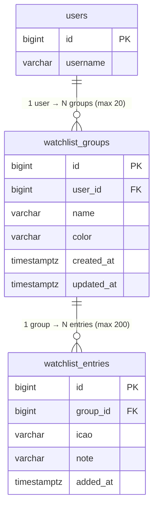
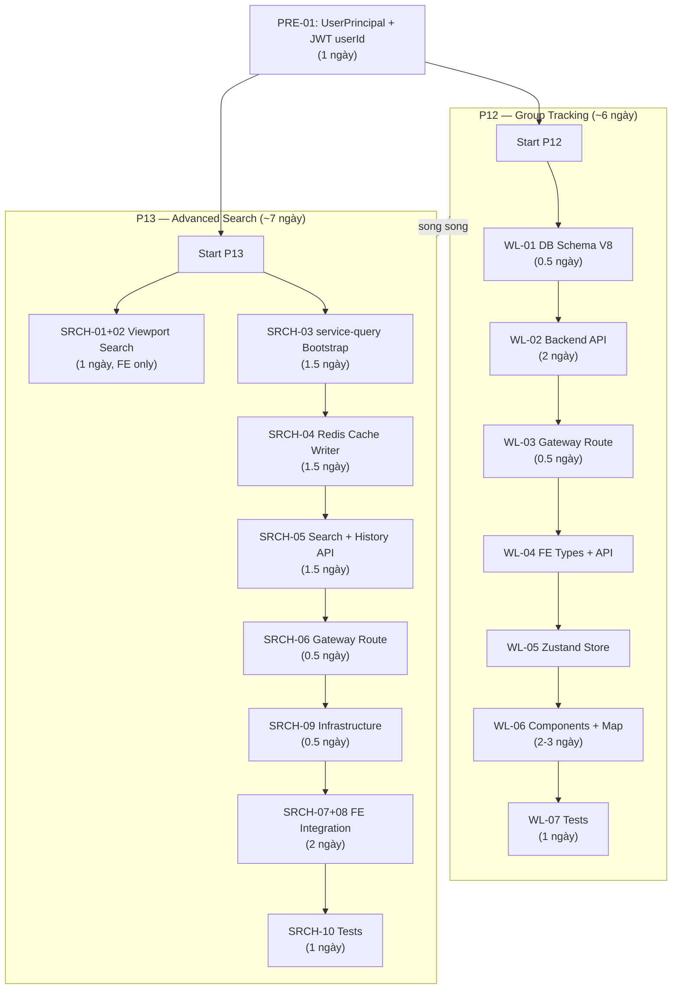

# Implementation Plan: P12 Group Tracking & P13 Advanced Search (v2)

## Bối cảnh & Quyết định đã chốt

| Quyết định | Kết quả | Ghi chú |
|---|---|---|
| Watchlist DB | **Auth DB** (cùng `users`, `roles`) | Trade-off chấp nhận; ghi nhận technical debt, tách khi cần scale |
| Live aircraft state cho search | **Redis cache** (subscribe `live-adsb` → `HSET` với TTL) | Cần secondary index cho performance |
| Thứ tự triển khai | **Song song** — P12 và P13 không phụ thuộc lẫn nhau | |
| Auth principal | **Thêm `userId` vào JWT claims** + tạo `UserPrincipal` class | Prerequisite cho cả P12 lẫn P13 |

**Hiện trạng:**
- P0–P10 đã hoàn thành. Pipeline ingest → processing → storage → broadcaster → frontend map hoạt động.
- Redis đang chạy nhưng **chỉ dùng cho rate limiting** tại gateway.
- [PLAN-MAP-FEATURES.md](../frontend-ui/PLAN-MAP-FEATURES.md) đã thiết kế frontend Phase 5 (Search) + Phase 6 (Watchlist) nhưng **chưa có backend**.
- `service-query` nằm ở P11 nhưng chưa triển khai.
- Auth DB đã có **V1 → V7** migrations. Next migration = **V8**.
- JWT hiện tại chỉ chứa `subject` (username) + `roles`, **không có `userId`**.
- Frontend dùng `useState<Page>` manual routing, không có React Router.
- `service-storage` port `8084` (local) — service-query cần port khác (**8085**).

---

## P0 — Prerequisites (Shared)

> Phải hoàn thành trước khi bắt đầu P12 hoặc P13.

### PRE-01: Thêm `userId` vào JWT + tạo `UserPrincipal`

**Vấn đề:** `JwtAuthenticationFilter` hiện set principal = `String` (username). Không có `userId` trong JWT claims. Toàn bộ watchlist CRUD cần `userId` để ownership check.

#### [MODIFY] `service-auth/src/main/kotlin/com/tracking/auth/security/JwtService.kt`

Thêm `userId` claim vào access token:

```kotlin
// Thêm parameter userId
public fun generateAccessToken(
    userId: Long,                                      // ← NEW
    username: String,
    roles: Set<String>,
    ttl: Duration = Duration.ofSeconds(accessTokenTtlSeconds),
): String {
    val now = Instant.now()
    return Jwts.builder()
        .header().keyId(jwksKeyProvider.activeKid()).and()
        .subject(username)
        .issuer(issuer)
        .issuedAt(Date.from(now))
        .expiration(Date.from(now.plus(ttl)))
        .claim(CLAIM_ROLES, roles.toList())
        .claim(CLAIM_USER_ID, userId)                  // ← NEW
        .id(UUID.randomUUID().toString())
        .signWith(jwksKeyProvider.activePrivateKey(), Jwts.SIG.RS256)
        .compact()
}

// Thêm extract method
public fun extractUserId(token: String): Long? {
    val claims = parseClaims(token) ?: return null
    return (claims[CLAIM_USER_ID] as? Number)?.toLong()
}

// Thêm constant trong companion object
private const val CLAIM_USER_ID: String = "uid"
```

#### [NEW] `service-auth/src/main/kotlin/com/tracking/auth/security/UserPrincipal.kt`

```kotlin
package com.tracking.auth.security

public data class UserPrincipal(
    val id: Long,
    val username: String,
    val roles: Set<String>,
)
```

#### [MODIFY] `service-auth/src/main/kotlin/com/tracking/auth/security/JwtAuthenticationFilter.kt`

Thay `username` String principal bằng `UserPrincipal`:

```kotlin
override fun doFilterInternal(
    request: HttpServletRequest,
    response: HttpServletResponse,
    filterChain: FilterChain,
) {
    val authHeader = request.getHeader(HttpHeaders.AUTHORIZATION)
    val token = jwtService.extractBearerToken(authHeader)

    if (token != null && SecurityContextHolder.getContext().authentication == null) {
        val username = jwtService.extractUsername(token)
        val userId = jwtService.extractUserId(token)              // ← NEW

        if (username != null && userId != null                     // ← CHANGED
            && jwtService.isTokenValid(token, username)
            && !jwtService.isRefreshToken(token)
        ) {
            val roles = jwtService.extractRoles(token)
            val authorities = roles.map { role -> SimpleGrantedAuthority(role) }
            val principal = UserPrincipal(                         // ← NEW
                id = userId,
                username = username,
                roles = roles,
            )
            val authentication = UsernamePasswordAuthenticationToken(
                principal, null, authorities,                      // ← CHANGED: principal thay vì username
            )
            authentication.details = WebAuthenticationDetailsSource().buildDetails(request)
            SecurityContextHolder.getContext().authentication = authentication
        }
    }

    filterChain.doFilter(request, response)
}
```

#### [MODIFY] `service-auth/src/main/kotlin/com/tracking/auth/api/AuthService.kt`

Cập nhật `issueTokens()` và `refresh()` để truyền `userId`:

```kotlin
private fun issueTokens(user: UserEntity): AuthTokensResponse {
    val accessToken = jwtService.generateAccessToken(
        userId = user.id!!,                  // ← NEW
        username = user.username,
        roles = user.roleNames(),
    )
    val refreshToken = refreshTokenService.issueForUser(user)
    return AuthTokensResponse(
        accessToken = accessToken,
        refreshToken = refreshToken,
    )
}
```

```kotlin
@Transactional
public fun refresh(request: RefreshTokenRequest): AuthTokensResponse {
    val rotationResult = refreshTokenService.rotate(request.refreshToken)
    val user = rotationResult.user
    if (!user.enabled) {
        throw ResponseStatusException(HttpStatus.FORBIDDEN, "User is disabled")
    }
    val accessToken = jwtService.generateAccessToken(
        userId = user.id!!,                  // ← NEW
        username = user.username,
        roles = user.roleNames(),
    )
    return AuthTokensResponse(
        accessToken = accessToken,
        refreshToken = rotationResult.newRefreshToken,
    )
}
```

> **Backward compatibility:** Existing access tokens (không có `uid` claim) sẽ fail `userId != null` check → request bị reject 401 → user re-login hoặc refresh token → nhận token mới có `uid`. Access token TTL = 15 phút, nên tự heal nhanh.

#### PRE-01 Tests

| Test | Scope |
|------|-------|
| `JwtServiceTest.kt` (update) | Verify `uid` claim present in generated token, `extractUserId()` returns correct value |
| `JwtAuthenticationFilterTest.kt` (update) | Verify `UserPrincipal` set as principal in SecurityContext, verify token without `uid` → no auth |
| `AuthServiceTest.kt` (update) | Verify `issueTokens()` và `refresh()` pass `userId` |

---

## P12 — Group Tracking (Watchlist)

### Tổng quan kiến trúc

```
┌──────────┐     ┌──────────────┐     ┌───────────┐     ┌────────────┐
│ Frontend │────→│ Gateway      │────→│ service-  │────→│ PostgreSQL │
│ Watchlist│←────│ /api/v1/     │←────│ auth      │←────│ auth DB    │
│ Panel    │ JWT │ watchlist/** │     │ Watchlist │     │ watchlist_ │
└──────────┘     └──────────────┘     │ Controller│     │ groups/    │
                                      └───────────┘     │ entries    │
                                                        └────────────┘
```

---

### WL-01: Database Schema

#### [NEW] `service-auth/src/main/resources/db/migration/V8__watchlist_tables.sql`

```sql
-- ============================================================
-- Watchlist Groups: mỗi user có nhiều group theo dõi
-- Max 20 groups per user (enforced at application layer)
-- ============================================================
CREATE TABLE IF NOT EXISTS watchlist_groups (
    id          BIGSERIAL PRIMARY KEY,
    user_id     BIGINT       NOT NULL REFERENCES users(id) ON DELETE CASCADE,
    name        VARCHAR(100) NOT NULL,
    color       VARCHAR(7)   NOT NULL DEFAULT '#3b82f6',
    created_at  TIMESTAMPTZ  NOT NULL DEFAULT NOW(),
    updated_at  TIMESTAMPTZ  NOT NULL DEFAULT NOW(),
    UNIQUE (user_id, name)
);

-- ============================================================
-- Watchlist Entries: aircraft trong group (many-to-many)
-- Max 200 entries per group (enforced at application layer)
-- ============================================================
CREATE TABLE IF NOT EXISTS watchlist_entries (
    id          BIGSERIAL PRIMARY KEY,
    group_id    BIGINT       NOT NULL REFERENCES watchlist_groups(id) ON DELETE CASCADE,
    icao        VARCHAR(6)   NOT NULL,
    note        VARCHAR(500),
    added_at    TIMESTAMPTZ  NOT NULL DEFAULT NOW(),
    UNIQUE (group_id, icao)
);

CREATE INDEX idx_wg_user     ON watchlist_groups(user_id);
CREATE INDEX idx_we_group    ON watchlist_entries(group_id);
CREATE INDEX idx_we_icao     ON watchlist_entries(icao);

-- ============================================================
-- Trigger: auto-update updated_at trên watchlist_groups
-- Postgres không tự update DEFAULT value khi UPDATE
-- ============================================================
CREATE OR REPLACE FUNCTION update_watchlist_group_timestamp()
RETURNS TRIGGER AS $$
BEGIN
    NEW.updated_at = NOW();
    RETURN NEW;
END;
$$ LANGUAGE plpgsql;

CREATE TRIGGER trg_watchlist_groups_updated_at
    BEFORE UPDATE ON watchlist_groups
    FOR EACH ROW EXECUTE FUNCTION update_watchlist_group_timestamp();
```

**Thay đổi so với plan v1:**
- ~~V3~~ → **V8** (V3–V7 đã tồn tại)
- Bỏ `callsign` column (callsign thay đổi theo flight, lưu snapshot misleading — lấy live từ WebSocket)
- Thêm trigger `updated_at` (Postgres không tự update DEFAULT khi UPDATE)
- Ghi rõ limits trong comments

**Quan hệ dữ liệu:**



---

### WL-02: Backend API (service-auth)

#### [NEW] Kotlin files trong `service-auth/src/main/kotlin/com/tracking/auth/watchlist/`

| File | Mô tả |
|------|-------|
| `WatchlistGroupEntity.kt` | JPA Entity map bảng `watchlist_groups` |
| `WatchlistEntryEntity.kt` | JPA Entity map bảng `watchlist_entries` |
| `WatchlistGroupRepository.kt` | `JpaRepository<WatchlistGroupEntity, Long>` + `findByUserId()` + `countByUserId()` |
| `WatchlistEntryRepository.kt` | `JpaRepository<WatchlistEntryEntity, Long>` + `findByGroupId()` + `countByGroupId()` + `findByGroupIdAndIcao()` |
| `WatchlistService.kt` | Business logic: ownership validation, CRUD, limits enforcement |
| `WatchlistController.kt` | REST endpoints (JWT protected via `UserPrincipal`) |
| `WatchlistDto.kt` | Request/Response DTOs với validation annotations |
| `WatchlistException.kt` | Domain exceptions |

**REST API Endpoints:**

| Method | Endpoint | Body | Response | Mô tả |
|--------|----------|------|----------|-------|
| `GET` | `/api/v1/watchlist` | — | `WatchlistGroupDto[]` | List groups (scoped by JWT userId) + entry count |
| `GET` | `/api/v1/watchlist/{groupId}` | — | `WatchlistGroupDto` | Get group with full entries (lazy load) |
| `POST` | `/api/v1/watchlist` | `CreateGroupRequest` | `WatchlistGroupDto` | Tạo group (max 20/user) |
| `PUT` | `/api/v1/watchlist/{groupId}` | `UpdateGroupRequest` | `WatchlistGroupDto` | Cập nhật group |
| `DELETE` | `/api/v1/watchlist/{groupId}` | — | `204` | Xóa group (cascade entries) |
| `POST` | `/api/v1/watchlist/{groupId}/aircraft` | `AddAircraftRequest` | `WatchlistEntryDto` | Thêm aircraft (max 200/group) |
| `POST` | `/api/v1/watchlist/{groupId}/aircraft/batch` | `BatchAddAircraftRequest` | `WatchlistEntryDto[]` | Batch thêm (max 50/request) |
| `DELETE` | `/api/v1/watchlist/{groupId}/aircraft/{icao}` | — | `204` | Xóa aircraft khỏi group |

#### DTOs với validation

```kotlin
package com.tracking.auth.watchlist

import jakarta.validation.constraints.NotBlank
import jakarta.validation.constraints.Pattern
import jakarta.validation.constraints.Size

public data class CreateGroupRequest(
    @field:NotBlank
    @field:Size(min = 1, max = 100)
    val name: String,

    @field:Pattern(regexp = "^#[0-9a-fA-F]{6}$", message = "Color must be hex format: #RRGGBB")
    val color: String? = null,
)

public data class UpdateGroupRequest(
    @field:Size(min = 1, max = 100)
    val name: String? = null,

    @field:Pattern(regexp = "^#[0-9a-fA-F]{6}$", message = "Color must be hex format: #RRGGBB")
    val color: String? = null,
)

public data class AddAircraftRequest(
    @field:NotBlank
    @field:Pattern(regexp = "^[0-9A-Fa-f]{6}$", message = "ICAO must be 6 hex characters")
    val icao: String,

    @field:Size(max = 500)
    val note: String? = null,
)

public data class BatchAddAircraftRequest(
    @field:Size(min = 1, max = 50, message = "Batch size must be 1-50")
    val entries: List<@jakarta.validation.Valid AddAircraftRequest>,
)

public data class WatchlistGroupDto(
    val id: Long,
    val name: String,
    val color: String,
    val entryCount: Int,
    val entries: List<WatchlistEntryDto>? = null,   // null khi list groups (lazy load)
    val createdAt: String,
    val updatedAt: String,
)

public data class WatchlistEntryDto(
    val id: Long,
    val groupId: Long,
    val icao: String,
    val note: String?,
    val addedAt: String,
)
```

#### Controller

```kotlin
@RestController
@RequestMapping("/api/v1/watchlist")
public class WatchlistController(private val watchlistService: WatchlistService) {

    @GetMapping
    public fun listGroups(
        @AuthenticationPrincipal user: UserPrincipal,
    ): ResponseEntity<List<WatchlistGroupDto>> {
        return ResponseEntity.ok(watchlistService.getGroupsByUser(user.id))
    }

    @GetMapping("/{groupId}")
    public fun getGroup(
        @AuthenticationPrincipal user: UserPrincipal,
        @PathVariable groupId: Long,
    ): ResponseEntity<WatchlistGroupDto> {
        return ResponseEntity.ok(watchlistService.getGroupWithEntries(user.id, groupId))
    }

    @PostMapping
    public fun createGroup(
        @AuthenticationPrincipal user: UserPrincipal,
        @RequestBody @Valid request: CreateGroupRequest,
    ): ResponseEntity<WatchlistGroupDto> {
        val group = watchlistService.createGroup(user.id, request)
        return ResponseEntity.status(HttpStatus.CREATED).body(group)
    }

    @PutMapping("/{groupId}")
    public fun updateGroup(
        @AuthenticationPrincipal user: UserPrincipal,
        @PathVariable groupId: Long,
        @RequestBody @Valid request: UpdateGroupRequest,
    ): ResponseEntity<WatchlistGroupDto> {
        return ResponseEntity.ok(watchlistService.updateGroup(user.id, groupId, request))
    }

    @DeleteMapping("/{groupId}")
    public fun deleteGroup(
        @AuthenticationPrincipal user: UserPrincipal,
        @PathVariable groupId: Long,
    ): ResponseEntity<Void> {
        watchlistService.deleteGroup(user.id, groupId)
        return ResponseEntity.noContent().build()
    }

    @PostMapping("/{groupId}/aircraft")
    public fun addAircraft(
        @AuthenticationPrincipal user: UserPrincipal,
        @PathVariable groupId: Long,
        @RequestBody @Valid request: AddAircraftRequest,
    ): ResponseEntity<WatchlistEntryDto> {
        val entry = watchlistService.addAircraft(user.id, groupId, request)
        return ResponseEntity.status(HttpStatus.CREATED).body(entry)
    }

    @PostMapping("/{groupId}/aircraft/batch")
    public fun addAircraftBatch(
        @AuthenticationPrincipal user: UserPrincipal,
        @PathVariable groupId: Long,
        @RequestBody @Valid request: BatchAddAircraftRequest,
    ): ResponseEntity<List<WatchlistEntryDto>> {
        val entries = watchlistService.addAircraftBatch(user.id, groupId, request)
        return ResponseEntity.status(HttpStatus.CREATED).body(entries)
    }

    @DeleteMapping("/{groupId}/aircraft/{icao}")
    public fun removeAircraft(
        @AuthenticationPrincipal user: UserPrincipal,
        @PathVariable groupId: Long,
        @PathVariable icao: String,
    ): ResponseEntity<Void> {
        watchlistService.removeAircraft(user.id, groupId, icao.uppercase())
        return ResponseEntity.noContent().build()
    }
}
```

#### Service với ownership guard + limits

```kotlin
@Service
public class WatchlistService(
    private val groupRepo: WatchlistGroupRepository,
    private val entryRepo: WatchlistEntryRepository,
) {
    private val log = LoggerFactory.getLogger(WatchlistService::class.java)

    companion object {
        const val MAX_GROUPS_PER_USER: Int = 20
        const val MAX_ENTRIES_PER_GROUP: Int = 200
    }

    @Transactional(readOnly = true)
    public fun getGroupsByUser(userId: Long): List<WatchlistGroupDto> {
        return groupRepo.findByUserId(userId).map { group ->
            group.toDto(entryCount = entryRepo.countByGroupId(group.id!!))
        }
    }

    @Transactional(readOnly = true)
    public fun getGroupWithEntries(userId: Long, groupId: Long): WatchlistGroupDto {
        val group = findOwnedGroup(userId, groupId)
        val entries = entryRepo.findByGroupId(group.id!!)
        return group.toDto(entries = entries.map { it.toDto() })
    }

    @Transactional
    public fun createGroup(userId: Long, request: CreateGroupRequest): WatchlistGroupDto {
        val currentCount = groupRepo.countByUserId(userId)
        if (currentCount >= MAX_GROUPS_PER_USER) {
            throw WatchlistLimitExceededException(
                "Maximum $MAX_GROUPS_PER_USER groups per user exceeded"
            )
        }
        val entity = WatchlistGroupEntity().apply {
            this.userId = userId
            this.name = request.name.trim()
            this.color = request.color ?: "#3b82f6"
        }
        val saved = groupRepo.save(entity)
        log.info("Watchlist group created: userId={}, groupId={}, name={}", userId, saved.id, saved.name)
        return saved.toDto(entryCount = 0)
    }

    @Transactional
    public fun addAircraft(userId: Long, groupId: Long, request: AddAircraftRequest): WatchlistEntryDto {
        val group = findOwnedGroup(userId, groupId)
        val currentCount = entryRepo.countByGroupId(group.id!!)
        if (currentCount >= MAX_ENTRIES_PER_GROUP) {
            throw WatchlistLimitExceededException(
                "Maximum $MAX_ENTRIES_PER_GROUP entries per group exceeded"
            )
        }
        val entry = WatchlistEntryEntity().apply {
            this.groupId = group.id!!
            this.icao = request.icao.uppercase()
            this.note = request.note
        }
        return entryRepo.save(entry).toDto()
    }

    @Transactional
    public fun addAircraftBatch(
        userId: Long, groupId: Long, request: BatchAddAircraftRequest,
    ): List<WatchlistEntryDto> {
        val group = findOwnedGroup(userId, groupId)
        val currentCount = entryRepo.countByGroupId(group.id!!)
        if (currentCount + request.entries.size > MAX_ENTRIES_PER_GROUP) {
            throw WatchlistLimitExceededException(
                "Adding ${request.entries.size} entries would exceed limit of $MAX_ENTRIES_PER_GROUP"
            )
        }
        return request.entries.map { req ->
            val entry = WatchlistEntryEntity().apply {
                this.groupId = group.id!!
                this.icao = req.icao.uppercase()
                this.note = req.note
            }
            entryRepo.save(entry).toDto()
        }
    }

    @Transactional
    public fun removeAircraft(userId: Long, groupId: Long, icao: String) {
        val group = findOwnedGroup(userId, groupId)
        val entry = entryRepo.findByGroupIdAndIcao(group.id!!, icao)
            ?: throw WatchlistNotFoundException("Aircraft $icao not found in group")
        entryRepo.delete(entry)
    }

    @Transactional
    public fun updateGroup(userId: Long, groupId: Long, request: UpdateGroupRequest): WatchlistGroupDto {
        val group = findOwnedGroup(userId, groupId)
        request.name?.let { group.name = it.trim() }
        request.color?.let { group.color = it }
        return groupRepo.save(group).toDto(entryCount = entryRepo.countByGroupId(group.id!!))
    }

    @Transactional
    public fun deleteGroup(userId: Long, groupId: Long) {
        val group = findOwnedGroup(userId, groupId)
        groupRepo.delete(group)
        log.info("Watchlist group deleted: userId={}, groupId={}", userId, groupId)
    }

    private fun findOwnedGroup(userId: Long, groupId: Long): WatchlistGroupEntity {
        val group = groupRepo.findById(groupId)
            .orElseThrow { WatchlistNotFoundException("Group not found") }
        if (group.userId != userId) {
            throw ResponseStatusException(HttpStatus.FORBIDDEN, "Access denied")
        }
        return group
    }
}
```

#### Exception handling

```kotlin
// WatchlistException.kt
public class WatchlistNotFoundException(message: String) :
    ResponseStatusException(HttpStatus.NOT_FOUND, message)

public class WatchlistLimitExceededException(message: String) :
    ResponseStatusException(HttpStatus.UNPROCESSABLE_ENTITY, message)
```

---

### WL-03: Gateway Routing

#### [MODIFY] `service-gateway/src/main/resources/application.yml`

**routes section** — thêm route mới **trước** `auth-route` (cụ thể hơn):

```yaml
        # === NEW: Watchlist route → service-auth ===
        - id: watchlist-route
          uri: ${GATEWAY_ROUTE_AUTH_URI:http://service-auth:8081}
          predicates:
            - Path=/api/v1/watchlist/**
          filters:
            - name: RequestRateLimiter
              args:
                key-resolver: '#{@gatewayUserKeyResolver}'
                redis-rate-limiter.replenishRate: 30
                redis-rate-limiter.burstCapacity: 60
          metadata:
            connect-timeout: 750
            response-timeout: 1500
```

**tracking.gateway.routes section** — cập nhật `jwt-protected-paths`:

```yaml
      jwt-protected-paths:
        - /api/v1/auth/**
        - /api/v1/watchlist/**     # ← NEW
        - /ws/live/**
```

**tracking.gateway.request-size.per-path** — thêm limit:

```yaml
        "/api/v1/watchlist/**": 65536     # 64KB — CRUD payloads nhỏ
```

---

### WL-04: Frontend Types & API Client

#### [NEW] `frontend-ui/src/features/watchlist/types/watchlistTypes.ts`

```typescript
export interface WatchlistGroup {
  id: number;
  name: string;
  color: string;             // "#3b82f6"
  entryCount: number;
  entries?: WatchlistEntry[];  // lazy loaded via GET /{groupId}
  createdAt: string;
  updatedAt: string;
  visibleOnMap: boolean;       // Client-side only (not persisted)
}

export interface WatchlistEntry {
  id: number;
  groupId: number;
  icao: string;
  note?: string;
  addedAt: string;
}

export interface CreateGroupRequest {
  name: string;
  color?: string;
}

export interface UpdateGroupRequest {
  name?: string;
  color?: string;
}

export interface AddAircraftRequest {
  icao: string;
  note?: string;
}
```

#### [NEW] `frontend-ui/src/features/watchlist/api/watchlistApi.ts`

```typescript
import { httpRequest } from '@/shared/api/httpClient';
import type {
  WatchlistGroup, WatchlistEntry,
  CreateGroupRequest, UpdateGroupRequest, AddAircraftRequest,
} from '../types/watchlistTypes';

const BASE = '/api/v1/watchlist';

export async function fetchGroups(): Promise<WatchlistGroup[]> {
  return httpRequest<WatchlistGroup[]>({ path: BASE, method: 'GET' });
}

export async function fetchGroupWithEntries(groupId: number): Promise<WatchlistGroup> {
  return httpRequest<WatchlistGroup>({ path: `${BASE}/${groupId}`, method: 'GET' });
}

export async function createGroup(req: CreateGroupRequest): Promise<WatchlistGroup> {
  return httpRequest<WatchlistGroup>({ path: BASE, method: 'POST', body: req });
}

export async function updateGroup(groupId: number, req: UpdateGroupRequest): Promise<WatchlistGroup> {
  return httpRequest<WatchlistGroup>({ path: `${BASE}/${groupId}`, method: 'PUT', body: req });
}

export async function deleteGroup(groupId: number): Promise<void> {
  await httpRequest<void>({ path: `${BASE}/${groupId}`, method: 'DELETE' });
}

export async function addAircraft(groupId: number, req: AddAircraftRequest): Promise<WatchlistEntry> {
  return httpRequest<WatchlistEntry>({
    path: `${BASE}/${groupId}/aircraft`, method: 'POST', body: req,
  });
}

export async function addAircraftBatch(
  groupId: number, entries: AddAircraftRequest[],
): Promise<WatchlistEntry[]> {
  return httpRequest<WatchlistEntry[]>({
    path: `${BASE}/${groupId}/aircraft/batch`, method: 'POST', body: { entries },
  });
}

export async function removeAircraft(groupId: number, icao: string): Promise<void> {
  await httpRequest<void>({
    path: `${BASE}/${groupId}/aircraft/${icao}`, method: 'DELETE',
  });
}
```

---

### WL-05: Frontend Zustand Store

#### [NEW] `frontend-ui/src/features/watchlist/store/useWatchlistStore.ts`

```typescript
import { create } from 'zustand';
import type { WatchlistGroup, WatchlistEntry } from '../types/watchlistTypes';
import * as api from '../api/watchlistApi';

interface WatchlistState {
  groups: WatchlistGroup[];
  loading: boolean;
  error: string | null;

  // CRUD Actions
  fetchGroups: () => Promise<void>;
  fetchGroupEntries: (groupId: number) => Promise<void>;
  createGroup: (name: string, color?: string) => Promise<void>;
  updateGroup: (groupId: number, updates: { name?: string; color?: string }) => Promise<void>;
  deleteGroup: (groupId: number) => Promise<void>;
  addAircraft: (groupId: number, icao: string, note?: string) => Promise<void>;
  removeAircraft: (groupId: number, icao: string) => Promise<void>;

  // Client-side UI
  toggleGroupVisibility: (groupId: number) => void;

  // Selectors
  getVisibleIcaos: () => Set<string>;
  getGroupsForIcao: (icao: string) => WatchlistGroup[];
  getIcaoColor: (icao: string) => string | undefined;
}

export const useWatchlistStore = create<WatchlistState>((set, get) => ({
  groups: [],
  loading: false,
  error: null,

  fetchGroups: async () => {
    set({ loading: true, error: null });
    try {
      const groups = await api.fetchGroups();
      set({ groups: groups.map(g => ({ ...g, visibleOnMap: true })), loading: false });
    } catch (e) {
      set({ error: (e as Error).message, loading: false });
    }
  },

  fetchGroupEntries: async (groupId: number) => {
    const group = await api.fetchGroupWithEntries(groupId);
    set(state => ({
      groups: state.groups.map(g =>
        g.id === groupId ? { ...g, entries: group.entries, entryCount: group.entryCount } : g,
      ),
    }));
  },

  createGroup: async (name, color) => {
    const group = await api.createGroup({ name, color });
    set(state => ({
      groups: [...state.groups, { ...group, visibleOnMap: true }],
    }));
  },

  updateGroup: async (groupId, updates) => {
    const updated = await api.updateGroup(groupId, updates);
    set(state => ({
      groups: state.groups.map(g => g.id === groupId ? { ...g, ...updated } : g),
    }));
  },

  deleteGroup: async (groupId) => {
    await api.deleteGroup(groupId);
    set(state => ({ groups: state.groups.filter(g => g.id !== groupId) }));
  },

  addAircraft: async (groupId, icao, note) => {
    const entry = await api.addAircraft(groupId, { icao, note });
    set(state => ({
      groups: state.groups.map(g => {
        if (g.id !== groupId) return g;
        return {
          ...g,
          entryCount: g.entryCount + 1,
          entries: g.entries ? [...g.entries, entry] : [entry],
        };
      }),
    }));
  },

  removeAircraft: async (groupId, icao) => {
    await api.removeAircraft(groupId, icao);
    set(state => ({
      groups: state.groups.map(g => {
        if (g.id !== groupId) return g;
        return {
          ...g,
          entryCount: g.entryCount - 1,
          entries: g.entries?.filter(e => e.icao !== icao),
        };
      }),
    }));
  },

  toggleGroupVisibility: (groupId) => {
    set(state => ({
      groups: state.groups.map(g =>
        g.id === groupId ? { ...g, visibleOnMap: !g.visibleOnMap } : g,
      ),
    }));
  },

  getVisibleIcaos: () => {
    const { groups } = get();
    const icaos = new Set<string>();
    for (const g of groups) {
      if (g.visibleOnMap && g.entries) {
        for (const e of g.entries) icaos.add(e.icao);
      }
    }
    return icaos;
  },

  getGroupsForIcao: (icao: string) => {
    return get().groups.filter(g => g.entries?.some(e => e.icao === icao));
  },

  getIcaoColor: (icao: string) => {
    const { groups } = get();
    for (const g of groups) {
      if (g.visibleOnMap && g.entries?.some(e => e.icao === icao)) {
        return g.color;
      }
    }
    return undefined;
  },
}));
```

---

### WL-06: Frontend Components & Integration

#### [NEW] `frontend-ui/src/features/watchlist/components/`

```
frontend-ui/src/features/watchlist/
├── types/
│   └── watchlistTypes.ts
├── api/
│   └── watchlistApi.ts
├── store/
│   └── useWatchlistStore.ts
├── hooks/
│   └── useWatchlistSync.ts        # Fetch groups on auth change
└── components/
    ├── WatchlistPanel.tsx          # Collapsible right-side overlay trên map
    ├── WatchlistGroupCard.tsx      # Card: color dot, name, count, eye toggle, expand
    ├── WatchlistAircraftRow.tsx    # Row: icao, note, remove button
    ├── AddToWatchlistDropdown.tsx  # Dropdown cho AircraftPopup
    └── CreateGroupInline.tsx       # Inline form: name + color picker
```

**Layout trong App.tsx:**
- Panels render **overlay** trên map (position absolute), không thay thế map
- Watchlist bên phải, Search bên trái — có thể mở đồng thời
- Toggle bằng icon button trong header
- Panel chỉ hiện khi `auth.isAuthenticated`

```
┌────────────────────────────────────────────────┐
│ Header  [Map] [Users] [Keys]      [🔍]  [👁]  │
├────────────────────────────────────────────────┤
│                                      ┌────────┐│
│           Map (full width)           │Watchlist││
│                                      │ Panel   ││
│                                      │(overlay)││
│                                      └────────┘│
└────────────────────────────────────────────────┘
```

#### [MODIFY] `frontend-ui/src/features/aircraft/components/AircraftPopup.tsx`

Thêm nút **"Add to watchlist"** vào `PopupContent`:

```tsx
// Import
import { AddToWatchlistDropdown } from '@/features/watchlist/components/AddToWatchlistDropdown';
import { useAuthStore } from '@/features/auth/store/useAuthStore';

// Trong PopupContent JSX, sau "View details" button
const auth = useAuthStore(s => s);
// ...
{auth.isAuthenticated && (
  <AddToWatchlistDropdown icao={aircraft.icao} />
)}
```

#### [MODIFY] `frontend-ui/src/App.tsx`

```tsx
// Thêm imports
import { WatchlistPanel } from './features/watchlist/components/WatchlistPanel';
import { useWatchlistSync } from './features/watchlist/hooks/useWatchlistSync';

// Trong App component
const [showWatchlist, setShowWatchlist] = useState(false);
useWatchlistSync(); // fetch groups khi auth changes

// Trong header — thêm toggle button (chỉ khi authenticated)
{auth.isAuthenticated && (
  <button
    className="rounded border border-slate-500 px-3 py-1 text-slate-200"
    onClick={() => setShowWatchlist(v => !v)}
    type="button"
  >
    {showWatchlist ? '✕' : '👁'} Watchlist
  </button>
)}

// Trong map section — wrap MapContainer với relative container
{currentPage === "map" && (
  <div className="relative min-h-0 flex-1">
    <MapContainer>
      <AircraftFeatureLayer />
    </MapContainer>
    {showWatchlist && auth.isAuthenticated && (
      <WatchlistPanel onClose={() => setShowWatchlist(false)} />
    )}
  </div>
)}
```

**Watchlist highlight trên map:**
- Aircraft thuộc visible watchlist groups → render stroke color = `group.color` + thicker border (3px vs 1px)
- Nếu thuộc nhiều groups → dùng màu group đầu tiên (theo alphabetical name)
- Implement trong `AircraftFeatureLayer` style function, query `useWatchlistStore.getIcaoColor(icao)`

---

### WL-07: Tests

| Layer | Test file | Scope |
|-------|-----------|-------|
| Backend | `WatchlistControllerTest.kt` | CRUD, JWT auth, ownership guard, 4xx/422 responses |
| Backend | `WatchlistServiceTest.kt` | Limits (20 groups, 200 entries), validation, edge cases |
| Frontend | `useWatchlistStore.test.ts` | Store actions, toggle, getVisibleIcaos, getIcaoColor |
| Frontend | `WatchlistPanel.test.tsx` | Component render, interaction, loading states |

**Backend test cases ưu tiên:**

```kotlin
// Happy paths
fun `should create group and return 201`()
fun `should list groups for authenticated user only`()
fun `should get group with entries`()
fun `should add aircraft to group and return 201`()
fun `should batch add aircraft and return 201`()
fun `should update group name and color`()
fun `should delete group and cascade entries`()
fun `should remove aircraft from group`()

// Ownership guard
fun `should return 403 when accessing other user group`()
fun `should return 403 when adding aircraft to other user group`()
fun `should return 403 when deleting other user group`()

// Limits enforcement
fun `should return 422 when exceeding 20 groups per user`()
fun `should return 422 when exceeding 200 entries per group`()
fun `should return 422 when batch add would exceed limit`()

// Validation
fun `should return 400 for invalid ICAO format`()
fun `should return 400 for invalid color format`()
fun `should return 400 for blank group name`()
fun `should return 400 for empty batch`()

// Edge cases
fun `should handle duplicate ICAO in same group gracefully`()
fun `should return 404 for non-existent group`()
fun `should return 404 when removing non-existent aircraft`()

// Auth
fun `should return 401 without JWT`()
```

---

## P13 — Advanced Search

### Tổng quan kiến trúc

```
┌──────────────┐                    ┌──────────────┐
│ Frontend     │   Viewport Search  │ useAircraft  │
│ SearchBar    │──────────────────→ │ Store        │  (in-memory filter, no API)
│              │                    │ (live data)  │
│              │                    └──────────────┘
│              │
│              │   Global Search    ┌──────────────┐     ┌───────┐
│              │──────────────────→ │ service-     │────→│ Redis │
│              │   /api/v1/aircraft │ query        │     │ live  │
│              │   /search          │ (port 8085)  │     │ state │
│              │                    │              │     └───────┘
│              │   History Search   │              │     ┌───────────┐
│              │──────────────────→ │              │────→│TimescaleDB│
│              │   /api/v1/aircraft │              │     │flight_    │
│              │   /search/history  │              │     │positions  │
└──────────────┘                    └──────────────┘     └───────────┘
                                          ↑
                                    ┌─────┴──────┐
                                    │   Kafka    │
                                    │ live-adsb  │
                                    │ (consumer) │
                                    └────────────┘
```

---

### SRCH-01 & SRCH-02: Frontend Viewport Search (no backend)

#### [NEW] `frontend-ui/src/features/search/`

```
frontend-ui/src/features/search/
├── types/
│   └── searchTypes.ts
├── store/
│   └── useSearchStore.ts
├── hooks/
│   └── useSearchAircraft.ts       # In-memory filter cho viewport mode
├── api/
│   └── searchApi.ts               # HTTP calls cho global/history mode
└── components/
    ├── SearchBar.tsx               # Input + mode switcher (viewport|global|history)
    ├── SearchPanel.tsx             # Kết quả overlay bên trái map
    ├── SearchResultList.tsx        # Danh sách kết quả (click → map zoom)
    └── AdvancedSearchForm.tsx      # Form cho history mode
```

**Search types:**

```typescript
// types/searchTypes.ts
export type SearchMode = 'viewport' | 'global' | 'history';

export interface SearchFilters {
  query: string;
  mode: SearchMode;
  // Advanced filters (history mode only)
  icao?: string;
  callsign?: string;
  aircraftType?: string;
  timeFrom?: string;             // ISO datetime
  timeTo?: string;
  altitudeMin?: number;          // feet
  altitudeMax?: number;
  speedMin?: number;             // kts
  speedMax?: number;
  boundingBox?: BoundingBox;
  sourceId?: string;
}

export interface BoundingBox {
  north: number;
  south: number;
  east: number;
  west: number;
}

export interface SearchResult {
  icao: string;
  callsign?: string;
  registration?: string;
  aircraftType?: string;
  lat: number;
  lon: number;
  altitude?: number;
  speed?: number;
  heading?: number;
  eventTime: number;
  sourceId?: string;
  operator?: string;
}
```

**Viewport search logic (in-memory, zero API calls):**

```typescript
// hooks/useSearchAircraft.ts
import type { Aircraft } from '@/features/aircraft/types/aircraftTypes';
import type { SearchResult } from '../types/searchTypes';

export function filterAircraftInViewport(
  aircraft: Record<string, Aircraft>,
  query: string,
): SearchResult[] {
  if (!query || query.length < 2) return [];
  const q = query.toLowerCase();
  return Object.values(aircraft)
    .filter(a =>
      a.icao.toLowerCase().includes(q) ||
      a.callsign?.toLowerCase().includes(q) ||
      a.registration?.toLowerCase().includes(q) ||
      a.operator?.toLowerCase().includes(q) ||
      a.aircraftType?.toLowerCase().includes(q)
    )
    .slice(0, 50)
    .map(a => ({
      icao: a.icao,
      callsign: a.callsign,
      registration: a.registration,
      aircraftType: a.aircraftType,
      lat: a.lat,
      lon: a.lon,
      altitude: a.altitude,
      speed: a.speed,
      heading: a.heading,
      eventTime: a.eventTime ?? 0,
      sourceId: a.sourceId,
      operator: a.operator,
    }));
}
```

---

### SRCH-03: service-query Module Bootstrap

> **Port note:** `service-storage` dùng port `8084` (local profile). service-query dùng **port 8085**.

#### [NEW] `service-query/` — Module mới

```
service-query/
├── build.gradle.kts
└── src/
    ├── main/
    │   ├── kotlin/com/tracking/query/
    │   │   ├── QueryApplication.kt
    │   │   ├── config/
    │   │   │   ├── SecurityConfig.kt        # JWT offline verify (JWKS cache)
    │   │   │   ├── JwtAuthFilter.kt         # Reusable JWT filter
    │   │   │   ├── RedisConfig.kt
    │   │   │   └── KafkaConsumerConfig.kt
    │   │   ├── cache/
    │   │   │   ├── LiveAircraftCacheWriter.kt
    │   │   │   ├── LiveAircraftCacheReader.kt
    │   │   │   └── StaleIndexCleaner.kt     # Scheduled cleanup
    │   │   ├── search/
    │   │   │   ├── SearchController.kt
    │   │   │   └── SearchService.kt
    │   │   ├── history/
    │   │   │   ├── HistoryController.kt
    │   │   │   └── HistoryService.kt
    │   │   └── dto/
    │   │       ├── SearchResult.kt
    │   │       ├── AdvancedSearchRequest.kt
    │   │       └── FlightPositionDto.kt
    │   └── resources/
    │       ├── application.yml
    │       └── application-local.yml
    └── test/
        └── kotlin/com/tracking/query/
            ├── cache/
            │   ├── LiveAircraftCacheWriterTest.kt
            │   └── LiveAircraftCacheReaderTest.kt
            ├── search/
            │   └── SearchControllerTest.kt
            └── history/
                └── HistoryControllerTest.kt
```

#### `service-query/build.gradle.kts`

```kotlin
plugins {
    id("org.springframework.boot")
    id("io.spring.dependency-management")
    kotlin("jvm")
    kotlin("plugin.spring")
}

dependencies {
    implementation(project(":common-dto"))
    implementation("org.springframework.boot:spring-boot-starter-web")
    implementation("org.springframework.boot:spring-boot-starter-data-redis")
    implementation("org.springframework.boot:spring-boot-starter-jdbc")
    implementation("org.springframework.boot:spring-boot-starter-actuator")
    implementation("org.springframework.kafka:spring-kafka")
    implementation("org.postgresql:postgresql")
    implementation("com.fasterxml.jackson.module:jackson-module-kotlin")
    implementation("io.micrometer:micrometer-registry-prometheus")
    implementation("com.github.ben-manes.caffeine:caffeine")

    // JWT offline verification (JWKS)
    implementation("io.jsonwebtoken:jjwt-api:0.12.6")
    runtimeOnly("io.jsonwebtoken:jjwt-impl:0.12.6")
    runtimeOnly("io.jsonwebtoken:jjwt-jackson:0.12.6")

    testImplementation("org.springframework.boot:spring-boot-starter-test")
    testImplementation("org.springframework.kafka:spring-kafka-test")
    testImplementation("com.h2database:h2")
}
```

#### `service-query/src/main/resources/application.yml`

```yaml
server:
  port: 8085

spring:
  application:
    name: service-query
  datasource:
    url: jdbc:postgresql://${DB_HOST:localhost}:${DB_PORT:5432}/${DB_NAME:tracking}
    username: ${DB_USER:tracking}
    password: ${DB_PASS:tracking}
    hikari:
      maximum-pool-size: 10
      connection-timeout: 3000
      read-only: true                  # Read-only — no writes to TimescaleDB
  data:
    redis:
      host: ${REDIS_HOST:localhost}
      port: ${REDIS_PORT:6379}
  kafka:
    bootstrap-servers: ${KAFKA_BOOTSTRAP_SERVERS:localhost:29092}
    consumer:
      group-id: service-query-live-cache
      auto-offset-reset: latest        # Chỉ cần data mới, KHÔNG replay history
      key-deserializer: org.apache.kafka.common.serialization.StringDeserializer
      value-deserializer: org.apache.kafka.common.serialization.StringDeserializer

tracking:
  query:
    live-cache:
      topic: live-adsb
      ttl-seconds: 300                 # 5 min aircraft TTL
      key-prefix: "aircraft:"
      index-key: "aircraft:index"      # Redis SET chứa tất cả active ICAO
      cleanup-interval-ms: 60000       # Stale index cleanup interval
    search:
      max-results: 100
      min-query-length: 2
    history:
      max-results: 5000
  security:
    jwt-issuer: ${AUTH_JWT_ISSUER:tracking-auth}
    jwks-uri: ${AUTH_JWKS_URI:http://service-auth:8081/api/v1/auth/.well-known/jwks.json}
    jwks-cache-ttl-seconds: 300

management:
  endpoints:
    web:
      exposure:
        include: health,info,prometheus
  endpoint:
    health:
      probes:
        enabled: true
  metrics:
    tags:
      application: ${spring.application.name}
    distribution:
      percentiles-histogram:
        http.server.requests: true
```

#### JWT offline verification strategy

service-query xác thực JWT **offline** bằng JWKS public keys từ service-auth:

1. Startup: fetch JWKS từ `http://service-auth:8081/api/v1/auth/.well-known/jwks.json`
2. Cache keys trong Caffeine cache (TTL 5 phút)
3. Mỗi request: parse JWT header → lấy `kid` → tìm public key trong cache → verify signature
4. On cache miss: refetch JWKS (rate limited 1 req/10s)

> **Lý do không trust gateway header:** Defense-in-depth. Nếu internal network bị compromise, service-query vẫn verify JWT independently.

---

### SRCH-04: Redis Live State Cache (Kafka → Redis)

#### [NEW] `LiveAircraftCacheWriter.kt`

Subscribe `live-adsb` topic → parse `EnrichedFlight` → ghi Redis hash + maintain secondary index:

```kotlin
@Component
public class LiveAircraftCacheWriter(
    private val redisTemplate: StringRedisTemplate,
    private val objectMapper: ObjectMapper,
    @Value("\${tracking.query.live-cache.ttl-seconds:300}")
    private val ttlSeconds: Long,
    @Value("\${tracking.query.live-cache.key-prefix:aircraft:}")
    private val keyPrefix: String,
    @Value("\${tracking.query.live-cache.index-key:aircraft:index}")
    private val indexKey: String,
) {
    private val logger = LoggerFactory.getLogger(javaClass)

    @KafkaListener(topics = ["\${tracking.query.live-cache.topic:live-adsb}"])
    public fun onLiveFlight(record: ConsumerRecord<String, String>) {
        try {
            val flight = objectMapper.readValue(record.value(), EnrichedFlight::class.java)
            val key = "$keyPrefix${flight.icao}"

            val fields = mutableMapOf(
                "icao" to flight.icao,
                "lat" to flight.lat.toString(),
                "lon" to flight.lon.toString(),
                "event_time" to flight.eventTime.toString(),
                "source_id" to flight.sourceId,
            )
            flight.altitude?.let { fields["altitude"] = it.toString() }
            flight.speed?.let { fields["speed"] = it.toString() }
            flight.heading?.let { fields["heading"] = it.toString() }
            flight.metadata?.let { meta ->
                meta.registration?.let { fields["registration"] = it }
                meta.aircraftType?.let { fields["aircraft_type"] = it }
                meta.operator?.let { fields["operator"] = it }
                meta.countryCode?.let { fields["country_code"] = it }
            }

            // Pipeline: HSET + EXPIRE + SADD index (3 commands, 1 round-trip)
            redisTemplate.executePipelined { connection ->
                val stringConn = connection.stringCommands()
                connection.hashCommands().hSet(
                    key.toByteArray(), fields.mapKeys { it.key.toByteArray() }
                        .mapValues { it.value.toByteArray() }
                )
                connection.keyCommands().expire(key.toByteArray(), ttlSeconds)
                connection.setCommands().sAdd(indexKey.toByteArray(), flight.icao.toByteArray())
                null
            }
        } catch (e: Exception) {
            logger.error("Failed to cache live flight: {}", e.message, e)
        }
    }
}
```

**Redis data model:**

```
KEY:    aircraft:780A3B                (TTL 300s — auto expire)
HASH:   icao           → "780A3B"
        lat            → "21.0285"
        lon            → "105.8542"
        altitude       → "35000"
        speed          → "480.5"
        heading        → "125.0"
        event_time     → "1708941600000"
        source_id      → "crawler_hn_1"
        registration   → "VN-A321"
        aircraft_type  → "A321"
        operator       → "Vietnam Airlines"
        country_code   → "vn"

SET:    aircraft:index                 (no TTL — cleanup bằng scheduled task)
        members: "780A3B", "A12B3C", ...
```

#### [NEW] `LiveAircraftCacheReader.kt`

```kotlin
@Component
public class LiveAircraftCacheReader(
    private val redisTemplate: StringRedisTemplate,
    @Value("\${tracking.query.live-cache.key-prefix:aircraft:}")
    private val keyPrefix: String,
    @Value("\${tracking.query.live-cache.index-key:aircraft:index}")
    private val indexKey: String,
) {
    /**
     * Search live aircraft matching query.
     *
     * Strategy:
     * 1. SMEMBERS aircraft:index → tất cả active ICAO
     * 2. Nếu query giống ICAO hex → pre-filter ICAO strings (fast, no Redis calls)
     * 3. Pipeline HGETALL cho candidates
     * 4. Text match trên hash fields
     *
     * Worst case: 50K aircraft → SMEMBERS ~1ms, pipeline HGETALL theo batches ~50-100ms.
     * ICAO prefix filter giảm candidates xuống 100-500 → ~5-10ms.
     */
    public fun searchLive(query: String, maxResults: Int = 100): List<SearchResult> {
        val q = query.lowercase()
        val allIcaos = redisTemplate.opsForSet().members(indexKey) ?: return emptyList()

        // Pre-filter: nếu query là hex pattern, filter ICAO trước khi hit Redis hash
        val isHexQuery = q.matches(Regex("^[0-9a-f]+$"))
        val candidates = if (isHexQuery) {
            allIcaos.filter { it.lowercase().contains(q) }
        } else {
            allIcaos.toList()
        }

        if (candidates.isEmpty()) return emptyList()

        // Pipeline HGETALL
        val results = mutableListOf<SearchResult>()
        val ops = redisTemplate.opsForHash<String, String>()
        for (icao in candidates) {
            if (results.size >= maxResults) break
            val hash = ops.entries("$keyPrefix$icao")
            if (hash.isEmpty()) continue
            if (isHexQuery || matchesQuery(hash, q)) {
                results.add(hashToSearchResult(hash))
            }
        }
        return results
    }

    private fun matchesQuery(hash: Map<String, String>, q: String): Boolean {
        return hash["icao"]?.lowercase()?.contains(q) == true ||
            hash["registration"]?.lowercase()?.contains(q) == true ||
            hash["aircraft_type"]?.lowercase()?.contains(q) == true ||
            hash["operator"]?.lowercase()?.contains(q) == true
    }

    private fun hashToSearchResult(hash: Map<String, String>): SearchResult {
        return SearchResult(
            icao = hash["icao"] ?: "",
            lat = hash["lat"]?.toDoubleOrNull() ?: 0.0,
            lon = hash["lon"]?.toDoubleOrNull() ?: 0.0,
            altitude = hash["altitude"]?.toIntOrNull(),
            speed = hash["speed"]?.toDoubleOrNull(),
            heading = hash["heading"]?.toDoubleOrNull(),
            eventTime = hash["event_time"]?.toLongOrNull() ?: 0,
            sourceId = hash["source_id"],
            registration = hash["registration"],
            aircraftType = hash["aircraft_type"],
            operator = hash["operator"],
        )
    }
}
```

#### [NEW] `StaleIndexCleaner.kt`

```kotlin
@Component
@EnableScheduling
public class StaleIndexCleaner(
    private val redisTemplate: StringRedisTemplate,
    @Value("\${tracking.query.live-cache.key-prefix:aircraft:}")
    private val keyPrefix: String,
    @Value("\${tracking.query.live-cache.index-key:aircraft:index}")
    private val indexKey: String,
) {
    private val logger = LoggerFactory.getLogger(javaClass)

    /** Xóa ICAO khỏi index nếu hash key đã expired (TTL hết) */
    @Scheduled(fixedRateString = "\${tracking.query.live-cache.cleanup-interval-ms:60000}")
    public fun cleanupStaleEntries() {
        val allIcaos = redisTemplate.opsForSet().members(indexKey) ?: return
        var removed = 0
        for (icao in allIcaos) {
            if (redisTemplate.hasKey("$keyPrefix$icao") != true) {
                redisTemplate.opsForSet().remove(indexKey, icao)
                removed++
            }
        }
        if (removed > 0) {
            logger.debug("Cleaned up {} stale entries from aircraft index", removed)
        }
    }
}
```

> **Performance analysis (v1):**
>
> | Aircraft count | SMEMBERS | Pipeline HGETALL (all) | ICAO prefix filter | Total |
> |---|---|---|---|---|
> | 10K | ~0.5ms | ~10-20ms | ~2-5ms | ~3-20ms |
> | 50K | ~1ms | ~50-100ms | ~5-15ms | ~6-100ms |
> | 100K+ | ~2ms | ~100-200ms | ~10-30ms | ~12-200ms |
>
> **Scale plan:** Nếu >100K aircraft, migrate sang **RediSearch FT.SEARCH** module. Architecture cho phép swap reader implementation mà không ảnh hưởng API.

---

### SRCH-05: Search & History API Endpoints

#### [NEW] `SearchController.kt`

```kotlin
@RestController
@RequestMapping("/api/v1/aircraft")
public class SearchController(
    private val searchService: SearchService,
) {
    /** Global search: query live aircraft in Redis cache */
    @GetMapping("/search")
    public fun searchGlobal(
        @RequestParam q: String,
        @RequestParam(defaultValue = "50") limit: Int,
    ): ResponseEntity<List<SearchResult>> {
        if (q.trim().length < 2) {
            return ResponseEntity.badRequest().build()
        }
        return ResponseEntity.ok(searchService.searchGlobal(q.trim(), limit.coerceIn(1, 100)))
    }

    /** Advanced search: multi-criteria across history DB */
    @PostMapping("/search/history")
    public fun searchHistory(
        @RequestBody @Valid request: AdvancedSearchRequest,
    ): ResponseEntity<List<SearchResult>> {
        return ResponseEntity.ok(searchService.searchHistory(request))
    }
}
```

#### [NEW] `HistoryController.kt`

```kotlin
@RestController
@RequestMapping("/api/v1/aircraft")
public class HistoryController(
    private val historyService: HistoryService,
) {
    /** Flight position trail for one ICAO within time range */
    @GetMapping("/{icao}/history")
    public fun getHistory(
        @PathVariable icao: String,
        @RequestParam from: Long,                    // epoch millis
        @RequestParam to: Long,                      // epoch millis
        @RequestParam(defaultValue = "1000") limit: Int,
    ): ResponseEntity<List<FlightPositionDto>> {
        if (!icao.matches(Regex("^[0-9A-Fa-f]{6}$"))) {
            return ResponseEntity.badRequest().build()
        }
        return ResponseEntity.ok(
            historyService.getHistory(icao.uppercase(), from, to, limit.coerceIn(1, 5000))
        )
    }
}
```

#### [NEW] `AdvancedSearchRequest.kt`

```kotlin
public data class AdvancedSearchRequest(
    @field:Size(max = 6)
    @field:Pattern(regexp = "^[0-9A-Fa-f]{1,6}$", message = "ICAO must be hex characters")
    val icao: String? = null,

    @field:Size(max = 20)
    val callsign: String? = null,

    @field:Size(max = 20)
    val aircraftType: String? = null,

    val timeFrom: Long? = null,          // epoch millis
    val timeTo: Long? = null,

    val altitudeMin: Int? = null,        // feet
    val altitudeMax: Int? = null,

    val speedMin: Double? = null,        // kts
    val speedMax: Double? = null,

    val boundingBox: BoundingBoxDto? = null,

    val sourceId: String? = null,

    @field:Max(5000)
    val limit: Int = 100,
) {
    init {
        // Ít nhất 1 filter phải có giá trị
        require(
            icao != null || callsign != null || aircraftType != null ||
            timeFrom != null || boundingBox != null || sourceId != null
        ) { "At least one search filter must be specified" }
    }
}

public data class BoundingBoxDto(
    val north: Double,
    val south: Double,
    val east: Double,
    val west: Double,
) {
    init {
        require(north > south) { "north must be greater than south" }
        require(east != west) { "east and west must differ" }
        // NOTE: Không handle antimeridian crossing — documented limitation
    }
}
```

#### [NEW] `SearchService.kt`

```kotlin
@Service
public class SearchService(
    private val cacheReader: LiveAircraftCacheReader,
    private val jdbcTemplate: JdbcTemplate,
) {
    public fun searchGlobal(query: String, limit: Int): List<SearchResult> {
        return cacheReader.searchLive(query, limit)
    }

    public fun searchHistory(request: AdvancedSearchRequest): List<SearchResult> {
        val sql = StringBuilder("""
            SELECT icao, lat, lon, altitude, speed, heading, event_time, source_id,
                   metadata->>'registration' AS registration,
                   metadata->>'aircraft_type' AS aircraft_type,
                   metadata->>'operator' AS operator
            FROM storage.flight_positions
            WHERE 1=1
        """.trimIndent())
        val params = mutableListOf<Any>()

        request.icao?.let {
            sql.append(" AND UPPER(icao) LIKE ?")
            params.add("${it.uppercase()}%")     // Prefix match → sử dụng index
        }
        request.timeFrom?.let {
            sql.append(" AND event_time >= to_timestamp(? / 1000.0)")
            params.add(it)
        }
        request.timeTo?.let {
            sql.append(" AND event_time <= to_timestamp(? / 1000.0)")
            params.add(it)
        }
        request.altitudeMin?.let {
            sql.append(" AND altitude >= ?")
            params.add(it)
        }
        request.altitudeMax?.let {
            sql.append(" AND altitude <= ?")
            params.add(it)
        }
        request.speedMin?.let {
            sql.append(" AND speed >= ?")
            params.add(it)
        }
        request.speedMax?.let {
            sql.append(" AND speed <= ?")
            params.add(it)
        }
        request.boundingBox?.let { bb ->
            // NOTE: Không handle antimeridian crossing
            sql.append(" AND lat BETWEEN ? AND ? AND lon BETWEEN ? AND ?")
            params.addAll(listOf(bb.south, bb.north, bb.west, bb.east))
        }
        request.sourceId?.let {
            sql.append(" AND source_id = ?")
            params.add(it)
        }

        sql.append(" ORDER BY event_time DESC LIMIT ?")
        params.add(request.limit.coerceIn(1, 5000))

        return jdbcTemplate.query(sql.toString(), params.toTypedArray()) { rs, _ ->
            SearchResult(
                icao = rs.getString("icao"),
                lat = rs.getDouble("lat"),
                lon = rs.getDouble("lon"),
                altitude = rs.getObject("altitude") as? Int,
                speed = rs.getObject("speed") as? Double,
                heading = rs.getObject("heading") as? Double,
                eventTime = rs.getTimestamp("event_time").time,
                sourceId = rs.getString("source_id"),
                registration = rs.getString("registration"),
                aircraftType = rs.getString("aircraft_type"),
                operator = rs.getString("operator"),
            )
        }
    }
}
```

> **Indexes tận dụng** (đã có trong service-storage migrations):
> - `idx_fp_icao_time (icao, event_time DESC)` → ICAO + time range queries (primary use case)
> - `idx_fp_latlon (lat, lon)` → bounding box area search
> - `uq_flight_positions_dedup (icao, event_time, lat, lon)` → dedup
>
> **Schema note:** `service-storage` dùng Flyway schema `storage`, nên query cần prefix `storage.flight_positions`.
>
> **Known limitation:** Bounding box search **KHÔNG handle antimeridian crossing** (date line). Chỉ support simple rectangular bounding box where `west < east`. Nếu cần radius/polygon/antimeridian → add PostGIS.

---

### SRCH-06: Gateway Routing

#### [MODIFY] `service-gateway/src/main/resources/application.yml`

**routes section** — thêm route (sau ws-live-route):

```yaml
        # === NEW: Query/Search route ===
        - id: query-route
          uri: ${GATEWAY_ROUTE_QUERY_URI:http://service-query:8085}
          predicates:
            - Path=/api/v1/aircraft/**
          filters:
            - name: RequestRateLimiter
              args:
                key-resolver: '#{@gatewayUserKeyResolver}'
                redis-rate-limiter.replenishRate: 10
                redis-rate-limiter.burstCapacity: 20
          metadata:
            connect-timeout: 1000
            response-timeout: 3000       # History queries có thể chậm
```

**tracking.gateway.routes** — cập nhật:

```yaml
      jwt-protected-paths:
        - /api/v1/auth/**
        - /api/v1/watchlist/**
        - /api/v1/aircraft/**          # ← NEW
        - /ws/live/**
```

```yaml
      request-size:
        per-path:
          "/api/v1/ingest/**": 262144
          "/api/v1/auth/**": 65536
          "/api/v1/watchlist/**": 65536
          "/api/v1/aircraft/**": 65536   # ← NEW
```

> **Rate limit reasoning:** Global search tốn tài nguyên (Redis SCAN). 10 req/s burst 20 cho mỗi user tránh abuse. Viewport search không qua gateway (in-memory).

---

### SRCH-07 & SRCH-08: Frontend Search Integration

#### [MODIFY] `App.tsx`

Thêm search bar + panel overlay bên trái map:

```
┌────────────────────────────────────────────────┐
│ Header  [Map] [Users] [Keys]      [🔍]  [👁]  │
├────────────────────────────────────────────────┤
│┌────────┐                          ┌──────────┐│
││ Search │      Map (full width)    │ Watchlist ││
││ Panel  │                          │  Panel    ││
││(overlay│                          │ (overlay) ││
│└────────┘                          └──────────┘│
└────────────────────────────────────────────────┘
```

- Search panel: overlay absolute left
- Watchlist panel: overlay absolute right
- Independent toggles, có thể mở đồng thời
- Search bar nằm trong Search Panel header

**Search API client:**

```typescript
// features/search/api/searchApi.ts
import { httpRequest } from '@/shared/api/httpClient';
import type { SearchFilters, SearchResult } from '../types/searchTypes';

export async function searchGlobal(query: string): Promise<SearchResult[]> {
  return httpRequest<SearchResult[]>({
    path: `/api/v1/aircraft/search?q=${encodeURIComponent(query)}`,
    method: 'GET',
  });
}

export async function searchHistory(filters: SearchFilters): Promise<SearchResult[]> {
  return httpRequest<SearchResult[]>({
    path: '/api/v1/aircraft/search/history',
    method: 'POST',
    body: filters,
  });
}

export async function getFlightHistory(
  icao: string, from: number, to: number,
): Promise<SearchResult[]> {
  return httpRequest<SearchResult[]>({
    path: `/api/v1/aircraft/${icao}/history?from=${from}&to=${to}`,
    method: 'GET',
  });
}
```

**Search UX behaviors:**
- **Viewport mode:** Debounce 200ms, filter in-memory, instant results
- **Global mode:** Debounce 500ms, call API, show loading spinner
- **History mode:** Form submit, call API, show loading + result count
- **Click result:** `map.getView().animate({ center: [lon, lat], zoom: 14, duration: 500 })`
- **Highlight:** Pulsing circle overlay tại kết quả location (2s animation)

---

### SRCH-09: Infrastructure Updates

#### [MODIFY] `settings.gradle.kts`

```kotlin
include("service-query")
```

#### [MODIFY] `infrastructure/docker-compose.yml`

Thêm service:

```yaml
  service-query:
    build: ../service-query
    ports:
      - "8085:8085"
    environment:
      - SPRING_PROFILES_ACTIVE=local
      - KAFKA_BOOTSTRAP_SERVERS=kafka:9092
      - DB_HOST=postgres
      - DB_PORT=5432
      - DB_NAME=tracking
      - DB_USER=tracking
      - DB_PASS=tracking
      - REDIS_HOST=redis
      - REDIS_PORT=6379
      - AUTH_JWKS_URI=http://service-auth:8081/api/v1/auth/.well-known/jwks.json
    depends_on:
      kafka:
        condition: service_healthy
      postgres:
        condition: service_healthy
      redis:
        condition: service_healthy
    networks:
      - tracking-net
    restart: unless-stopped
    healthcheck:
      test: ["CMD", "curl", "-f", "http://localhost:8085/actuator/health"]
      interval: 10s
      timeout: 3s
      retries: 5
```

---

### SRCH-10: Tests

| Layer | Test file | Scope |
|-------|-----------|-------|
| Backend | `LiveAircraftCacheWriterTest.kt` | Kafka message → Redis HSET correctness, TTL set, index SADD |
| Backend | `LiveAircraftCacheReaderTest.kt` | ICAO prefix search, text match, maxResults limit, empty results |
| Backend | `StaleIndexCleanerTest.kt` | Stale entry removal, no false removal of live entries |
| Backend | `SearchControllerTest.kt` | Global search 200, 400 for short query, result format |
| Backend | `SearchServiceTest.kt` | SQL builder logic, parameter binding, limit clamp |
| Backend | `HistoryControllerTest.kt` | ICAO validation, time range, 400 for bad ICAO |
| Frontend | `useSearchStore.test.ts` | Mode switching, viewport filter logic, debounce |
| Frontend | `SearchPanel.test.tsx` | Component render, search input, result click → map action |

---

## Dependency Order & Phân luồng



---

## Ước tính thời gian

| Task | Thời gian | Ghi chú |
|------|-----------|---------|
| **PRE-01** UserPrincipal + JWT userId | **1 ngày** | Blocking dependency, cần careful testing |
| WL-01 DB schema (V8) | 0.5 ngày | Flyway migration + trigger |
| WL-02 Backend API + validation + limits | 2 ngày | Entity, Repo, Service, Controller, DTOs, Exceptions |
| WL-03 Gateway route | 0.5 ngày | Config + rate limit |
| WL-04–06 Frontend watchlist | 2–3 ngày | Types, API, Store, Panel, Popup, Map highlight |
| WL-07 Tests | 1 ngày | Backend + frontend tests |
| SRCH-01–02 Viewport search | 1 ngày | Frontend-only, in-memory |
| SRCH-03 service-query bootstrap | 1.5 ngày | Module, config, JWKS offline verify |
| SRCH-04 Redis cache writer + index | 1.5 ngày | Kafka consumer → Redis + cleanup |
| SRCH-05 Search + History API | 1.5 ngày | Controllers + services + SQL builder |
| SRCH-06 Gateway route | 0.5 ngày | Config + rate limit |
| SRCH-07–08 Frontend integration | 2 ngày | API, SearchPanel, mode switch, map zoom |
| SRCH-09 Infrastructure | 0.5 ngày | settings.gradle, docker-compose |
| SRCH-10 Tests | 1 ngày | Backend + frontend tests |
| **Tổng** | **~16–18 ngày** | Song song 2 tracks: **~10–11 ngày** |

---

## Known Limitations & Future Work

| # | Limitation | Impact | Future Fix |
|---|---|---|---|
| 1 | Bounding box search không handle antimeridian | Search cross date line trả sai kết quả | PostGIS + `ST_MakeEnvelope` |
| 2 | Redis text search O(N) toàn bộ aircraft | ~50-100ms worst case, OK cho <100K | RediSearch `FT.SEARCH` module |
| 3 | Watchlist trong Auth DB | Mixed domain concerns, cùng connection pool | Tách DB riêng khi scale |
| 4 | No full-text search / fuzzy match | Exact substring match only | Elasticsearch hoặc RediSearch |
| 5 | Frontend manual routing (`useState`) | Không có deep link, back button | React Router khi >5 pages |
| 6 | Callsign không lưu trong watchlist | Hiển thị live callsign thay vì snapshot | Có thể add optional column nếu cần |
| 7 | History search chậm cho time range rộng | Full table scan nếu không có ICAO filter | Require ICAO hoặc time range < 7 ngày |

---

## Verification Plan

### Automated Tests

```bash
# PRE-01 tests
.\gradlew :service-auth:test --tests "*JwtService*"
.\gradlew :service-auth:test --tests "*JwtAuthenticationFilter*"

# P12 Backend tests
.\gradlew :service-auth:test --tests "*Watchlist*"

# P13 Backend tests
.\gradlew :service-query:test

# API compatibility check
.\gradlew :service-auth:apiCheck

# Frontend tests
cd frontend-ui && npx vitest run --reporter verbose
```

### Manual E2E Flows

| # | Flow | Steps | Expected |
|---|------|-------|----------|
| 1 | PRE-01 backward compat | Old token (no `uid`) → request | 401 → re-login → new token with `uid` works |
| 2 | Watchlist CRUD | Login → Create "VN Airlines" → Add 780A3B → Verify panel → Update color → Delete aircraft → Delete group | All operations succeed |
| 3 | Watchlist persist | Add aircraft → Refresh page | Data persists, groups reload |
| 4 | Watchlist map highlight | Toggle group visibility | Aircraft stroke = group.color when visible, normal when hidden |
| 5 | Ownership guard | User A creates group → User B tries to access | 403 Forbidden |
| 6 | Limits | Create 21st group | 422 "Maximum 20 groups per user exceeded" |
| 7 | Limits | Add 201st aircraft to group | 422 "Maximum 200 entries per group exceeded" |
| 8 | Batch add | POST aircraft/batch with 10 entries | All 10 created, entryCount updated |
| 9 | Viewport search | Type "780" in viewport mode | Instant filter từ in-memory store |
| 10 | Global search | Switch to "Global" → type "780" | Results từ Redis cache (all live aircraft) |
| 11 | History search | Advanced form: ICAO + time range | Results từ TimescaleDB flight_positions |
| 12 | Search → Map | Click result | Map animates to [lon, lat] zoom 14 |
| 13 | Rate limit | Spam 30+ search requests/s | Some 429 responses |
| 14 | Validation | POST ICAO "ZZZZZZ" (not hex) | 400 Bad Request |

---

## Changelog v1 → v2

| # | Change | Reason |
|---|---|---|
| 1 | ~~V3~~ → **V8** migration | V3–V7 đã tồn tại trong service-auth |
| 2 | Thêm **PRE-01**: `UserPrincipal` + JWT `uid` claim | v1 dùng `@AuthenticationPrincipal user: UserPrincipal` nhưng class + claim không tồn tại |
| 3 | Bỏ `callsign` column khỏi `watchlist_entries` | Callsign thay đổi theo flight, snapshot misleading |
| 4 | Thêm DB trigger `updated_at` | Postgres không tự update DEFAULT value |
| 5 | Thêm **resource limits**: 20 groups/user, 200 entries/group | Prevent abuse |
| 6 | Thêm **batch add** endpoint `POST aircraft/batch` | Tránh 50+ API calls khi add nhiều aircraft |
| 7 | Thêm **input validation** với regex patterns | ICAO hex, color hex, size limits |
| 8 | Thêm **rate limiting** cho search (10 req/s) + watchlist (30 req/s) | Search tốn tài nguyên |
| 9 | Redis: thêm **secondary index** (`aircraft:index` SET) | SCAN O(N) quá chậm, SET + pipeline nhanh hơn |
| 10 | Redis: thêm **StaleIndexCleaner** scheduled task | Index SET không có TTL, cần cleanup |
| 11 | service-query port ~~8084~~ → **8085** | service-storage đã dùng 8084 |
| 12 | Kafka consumer offset: ~~earliest~~ → **latest** | Live cache không cần replay history |
| 13 | Thêm `AdvancedSearchRequest.init {}` validation | Require ít nhất 1 filter để tránh full table scan |
| 14 | API endpoint: ~~`/search/advanced`~~ → **`/search/history`** | Tên rõ ràng hơn |
| 15 | Lazy load entries: list groups trả `entryCount` only | Tránh payload lớn khi user có nhiều entries |
| 16 | Thêm Known Limitations + Future Work section | Document technical debt rõ ràng |
| 17 | Thêm **WatchlistException** classes | Typed exceptions thay vì generic ResponseStatusException |
| 18 | Ước tính thời gian: ~~12–14~~ → **16–18 ngày** | Thêm PRE-01 + validation + limits + secondary index |
