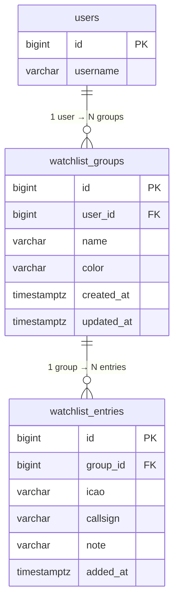
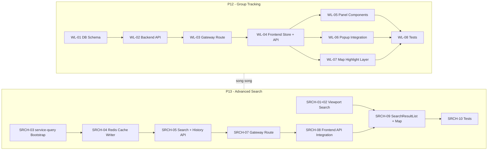

# Implementation Plan: P12 Group Tracking & P13 Advanced Search

## Bối cảnh & Quyết định đã chốt

| Quyết định | Kết quả |
|---|---|
| Watchlist DB | **Auth DB** (cùng `users`, `roles` — Option A) |
| Live aircraft state cho search | **Redis cache** (subscribe `live-adsb` → `HSET` với TTL) |
| Thứ tự triển khai | **Song song** — P12 và P13 không phụ thuộc lẫn nhau |

**Hiện trạng:**
- P0–P10 đã hoàn thành. Pipeline ingest → processing → storage → broadcaster → frontend map hoạt động.
- Redis đang chạy nhưng **chỉ dùng cho rate limiting** tại gateway (rất rảnh).
- [PLAN-MAP-FEATURES.md](file:///c:/Users/NamP7/Documents/workspace/2026/tracking-2026/frontend-ui/PLAN-MAP-FEATURES.md) đã thiết kế frontend Phase 5 (Search) + Phase 6 (Watchlist) nhưng **chưa có backend**.
- `service-query` nằm ở P11 `STOX-05`/`STOX-06` nhưng chưa triển khai.

---

## P12 — Group Tracking (Watchlist)

### Tổng quan kiến trúc

```
┌──────────┐     ┌──────────────┐     ┌───────────┐     ┌────────────┐
│ Frontend │────→│ Gateway      │────→│ service-  │────→│ PostgreSQL │
│ Watchlist│←────│ /api/v1/     │←────│ auth      │←────│ auth DB    │
│ Panel    │ JWT │ watchlist/** │     │ Watchlist │     │ watchlist_ │
└──────────┘     └──────────────┘     │ Controller│     │ groups/    │
                                      └───────────┘     │ entries    │
                                                        └────────────┘
```

---

### WL-01: Database Schema

#### [NEW] [V3__watchlist_tables.sql](file:///c:/Users/NamP7/Documents/workspace/2026/tracking-2026/service-auth/src/main/resources/db/migration/V3__watchlist_tables.sql)

```sql
-- ============================================================
-- Watchlist Groups: mỗi user có nhiều group theo dõi
-- ============================================================
CREATE TABLE IF NOT EXISTS watchlist_groups (
    id          BIGSERIAL PRIMARY KEY,
    user_id     BIGINT       NOT NULL REFERENCES users(id) ON DELETE CASCADE,
    name        VARCHAR(100) NOT NULL,
    color       VARCHAR(7)   NOT NULL DEFAULT '#3b82f6',
    created_at  TIMESTAMPTZ  NOT NULL DEFAULT NOW(),
    updated_at  TIMESTAMPTZ  NOT NULL DEFAULT NOW(),
    UNIQUE (user_id, name)                  -- User không tạo trùng tên group
);

-- ============================================================
-- Watchlist Entries: aircraft trong group (many-to-many)
-- Một aircraft (icao) thuộc nhiều groups, kể cả cùng user
-- ============================================================
CREATE TABLE IF NOT EXISTS watchlist_entries (
    id          BIGSERIAL PRIMARY KEY,
    group_id    BIGINT       NOT NULL REFERENCES watchlist_groups(id) ON DELETE CASCADE,
    icao        VARCHAR(6)   NOT NULL,
    callsign    VARCHAR(20),               -- Snapshot callsign lúc thêm
    note        VARCHAR(500),              -- Ghi chú user
    added_at    TIMESTAMPTZ  NOT NULL DEFAULT NOW(),
    UNIQUE (group_id, icao)                -- Không trùng icao trong cùng group
);

CREATE INDEX idx_wg_user     ON watchlist_groups(user_id);
CREATE INDEX idx_we_group    ON watchlist_entries(group_id);
CREATE INDEX idx_we_icao     ON watchlist_entries(icao);
```

**Quan hệ dữ liệu:**



---

### WL-02: Backend API (service-auth)

#### [NEW] Kotlin files trong `service-auth/src/main/kotlin/com/tracking/auth/watchlist/`

| File | Mô tả |
|------|-------|
| `WatchlistGroupEntity.kt` | JPA Entity map bảng `watchlist_groups` |
| `WatchlistEntryEntity.kt` | JPA Entity map bảng `watchlist_entries` |
| `WatchlistGroupRepository.kt` | `JpaRepository<WatchlistGroupEntity, Long>` + `findByUserId()` |
| `WatchlistEntryRepository.kt` | `JpaRepository<WatchlistEntryEntity, Long>` + `findByGroupId()`, `findByIcao()` |
| `WatchlistService.kt` | Business logic: ownership validation, CRUD |
| `WatchlistController.kt` | REST endpoints (JWT protected) |
| `WatchlistDto.kt` | Request/Response DTOs |

**REST API Endpoints:**

| Method | Endpoint | Body | Response | Mô tả |
|--------|----------|------|----------|-------|
| `GET` | `/api/v1/watchlist` | — | `WatchlistGroupDto[]` | List groups (scoped by JWT `userId`) + entries |
| `POST` | `/api/v1/watchlist` | `{ name, color? }` | `WatchlistGroupDto` | Tạo group |
| `PUT` | `/api/v1/watchlist/{groupId}` | `{ name?, color? }` | `WatchlistGroupDto` | Cập nhật group |
| `DELETE` | `/api/v1/watchlist/{groupId}` | — | `204` | Xóa group (cascade entries) |
| `POST` | `/api/v1/watchlist/{groupId}/aircraft` | `{ icao, callsign?, note? }` | `WatchlistEntryDto` | Thêm aircraft |
| `DELETE` | `/api/v1/watchlist/{groupId}/aircraft/{icao}` | — | `204` | Xóa aircraft khỏi group |

**Controller code sketch:**

```kotlin
@RestController
@RequestMapping("/api/v1/watchlist")
class WatchlistController(private val watchlistService: WatchlistService) {

    @GetMapping
    fun listGroups(@AuthenticationPrincipal user: UserPrincipal): ResponseEntity<List<WatchlistGroupDto>> {
        return ResponseEntity.ok(watchlistService.getGroupsByUser(user.id))
    }

    @PostMapping
    fun createGroup(
        @AuthenticationPrincipal user: UserPrincipal,
        @RequestBody @Valid request: CreateGroupRequest,
    ): ResponseEntity<WatchlistGroupDto> {
        val group = watchlistService.createGroup(user.id, request.name, request.color)
        return ResponseEntity.status(HttpStatus.CREATED).body(group)
    }

    @PostMapping("/{groupId}/aircraft")
    fun addAircraft(
        @AuthenticationPrincipal user: UserPrincipal,
        @PathVariable groupId: Long,
        @RequestBody @Valid request: AddAircraftRequest,
    ): ResponseEntity<WatchlistEntryDto> {
        val entry = watchlistService.addAircraft(user.id, groupId, request)
        return ResponseEntity.status(HttpStatus.CREATED).body(entry)
    }

    // ... PUT, DELETE endpoints
}
```

**Service ownership guard:**

```kotlin
@Service
class WatchlistService(
    private val groupRepo: WatchlistGroupRepository,
    private val entryRepo: WatchlistEntryRepository,
) {
    fun getGroupsByUser(userId: Long): List<WatchlistGroupDto> {
        return groupRepo.findByUserId(userId).map { it.toDto(entryRepo.findByGroupId(it.id)) }
    }

    fun createGroup(userId: Long, name: String, color: String?): WatchlistGroupDto {
        val entity = WatchlistGroupEntity(userId = userId, name = name, color = color ?: "#3b82f6")
        return groupRepo.save(entity).toDto(emptyList())
    }

    fun addAircraft(userId: Long, groupId: Long, request: AddAircraftRequest): WatchlistEntryDto {
        val group = groupRepo.findById(groupId).orElseThrow { NotFoundException("Group not found") }
        require(group.userId == userId) { "Access denied" }  // Ownership check
        val entry = WatchlistEntryEntity(groupId = groupId, icao = request.icao.uppercase(),
            callsign = request.callsign, note = request.note)
        return entryRepo.save(entry).toDto()
    }
    // ...
}
```

---

### WL-03: Gateway Routing

#### [MODIFY] [application.yml](file:///c:/Users/NamP7/Documents/workspace/2026/tracking-2026/service-gateway/src/main/resources/application.yml)

Thêm route mới **trước** `auth-route` (vì `/api/v1/watchlist/**` cụ thể hơn `/api/v1/auth/**`):

```yaml
        # === NEW: Watchlist route ===
        - id: watchlist-route
          uri: ${GATEWAY_ROUTE_AUTH_URI:http://service-auth:8081}
          predicates:
            - Path=/api/v1/watchlist/**
          filters:
            - name: RequestRateLimiter
              args:
                key-resolver: '#{@gatewayUserKeyResolver}'
                redis-rate-limiter.replenishRate: 50
                redis-rate-limiter.burstCapacity: 100
          metadata:
            connect-timeout: 750
            response-timeout: 1500
```

Cập nhật `jwt-protected-paths`:

```yaml
      jwt-protected-paths:
        - /api/v1/auth/**
        - /api/v1/watchlist/**     # ← NEW
        - /ws/live/**
```

---

### WL-04–WL-07: Frontend Watchlist Feature

#### [NEW] `frontend-ui/src/features/watchlist/` — Thư mục mới

```
frontend-ui/src/features/watchlist/
├── types/
│   └── watchlistTypes.ts          # Types: WatchlistGroup, WatchlistEntry
├── api/
│   └── watchlistApi.ts            # HTTP client → /api/v1/watchlist/*
├── store/
│   └── useWatchlistStore.ts       # Zustand store + CRUD actions
├── hooks/
│   └── useWatchlistSync.ts        # Fetch watchlist on mount, auto-refresh
└── components/
    ├── WatchlistPanel.tsx          # Right side panel (collapsible)
    ├── WatchlistGroupCard.tsx      # Card: group name, color dot, count, toggle
    ├── WatchlistAircraftRow.tsx    # Row: icao, callsign, note, remove button
    └── WatchlistMapToggle.tsx      # Toggle visibility trên map
```

**Data types:**

```typescript
// types/watchlistTypes.ts
export interface WatchlistGroup {
  id: number;
  name: string;
  color: string;             // "#3b82f6"
  createdAt: string;
  updatedAt: string;
  entries: WatchlistEntry[];
  visibleOnMap: boolean;     // Client-side only (ui state)
}

export interface WatchlistEntry {
  id: number;
  groupId: number;
  icao: string;
  callsign?: string;
  note?: string;
  addedAt: string;
}
```

**Zustand store:**

```typescript
// store/useWatchlistStore.ts
interface WatchlistState {
  groups: WatchlistGroup[];
  loading: boolean;
  error: string | null;
  
  // Actions
  fetchGroups: () => Promise<void>;
  createGroup: (name: string, color?: string) => Promise<void>;
  deleteGroup: (groupId: number) => Promise<void>;
  updateGroup: (groupId: number, updates: Partial<Pick<WatchlistGroup, 'name' | 'color'>>) => Promise<void>;
  addAircraft: (groupId: number, icao: string, callsign?: string, note?: string) => Promise<void>;
  removeAircraft: (groupId: number, icao: string) => Promise<void>;
  toggleGroupVisibility: (groupId: number) => void;   // Client-side toggle
  
  // Selectors
  getGroupsForIcao: (icao: string) => WatchlistGroup[];
  getVisibleIcaos: () => Set<string>;                  // All icao visible on map
}
```

#### [MODIFY] [AircraftPopup.tsx](file:///c:/Users/NamP7/Documents/workspace/2026/tracking-2026/frontend-ui/src/features/aircraft/components/AircraftPopup.tsx)

- Thêm nút **"➕ Add to watchlist"** với dropdown list groups
- Nút **"Create new group"** inline
- Hiển thị badge nếu aircraft đã thuộc group nào

#### [MODIFY] [App.tsx](file:///c:/Users/NamP7/Documents/workspace/2026/tracking-2026/frontend-ui/src/App.tsx)

- Import và render `WatchlistPanel` bên phải map (collapsible sidebar)
- Tương tự layout trong PLAN-MAP-FEATURES.md

**Watchlist highlight trên map:**  
Aircraft thuộc visible watchlist groups → render với **stroke color = group.color** + thicker border. Nếu thuộc nhiều groups → dùng màu group đầu tiên (highest priority).

---

### WL-08: Tests

| Layer | Test file | Scope |
|-------|-----------|-------|
| Backend | `WatchlistControllerTest.kt` | CRUD endpoints, JWT auth, ownership guard |
| Backend | `WatchlistServiceTest.kt` | Business logic, validation, edge cases |
| Frontend | `useWatchlistStore.test.ts` | Store actions: add/remove group, add/remove aircraft, toggle |
| Frontend | `WatchlistPanel.test.tsx` | Component render, interaction |

---

## P13 — Advanced Search

### Tổng quan kiến trúc

```
┌──────────────┐                    ┌──────────────┐
│ Frontend     │   Viewport Search  │ useAircraft  │
│ SearchBar    │──────────────────→ │ Store        │  (in-memory filter, no API)
│              │                    │ (live data)  │
│              │                    └──────────────┘
│              │
│              │   Global Search    ┌──────────────┐     ┌───────┐
│              │──────────────────→ │ service-     │────→│ Redis │
│              │   /api/v1/aircraft │ query        │     │ live  │
│              │   /search          │              │     │ state │
│              │                    │              │     └───────┘
│              │   History Search   │              │     ┌───────────┐
│              │──────────────────→ │              │────→│TimescaleDB│
│              │   /api/v1/aircraft │              │     │flight_    │
│              │   /search/advanced │              │     │positions  │
└──────────────┘                    └──────────────┘     └───────────┘
                                          ↑
                                    ┌─────┴──────┐
                                    │   Kafka    │
                                    │ live-adsb  │
                                    │ (consumer) │
                                    └────────────┘
```

---

### SRCH-01 & SRCH-02: Frontend Viewport Search (no backend)

#### [NEW] `frontend-ui/src/features/search/` — Thư mục mới

```
frontend-ui/src/features/search/
├── types/
│   └── searchTypes.ts
├── store/
│   └── useSearchStore.ts
├── hooks/
│   └── useSearchAircraft.ts
└── components/
    ├── SearchBar.tsx
    ├── SearchPanel.tsx
    ├── SearchResultList.tsx
    └── AdvancedSearchForm.tsx
```

**Search types:**

```typescript
// types/searchTypes.ts
export type SearchMode = 'viewport' | 'global' | 'history';

export interface SearchFilters {
  query: string;                    // ICAO, callsign, registration
  mode: SearchMode;
  // Advanced filters (history mode)
  icao?: string;
  callsign?: string;
  registration?: string;
  aircraftType?: string;
  timeFrom?: string;               // ISO datetime
  timeTo?: string;
  altitudeMin?: number;             // feet
  altitudeMax?: number;
  speedMin?: number;                // kts
  speedMax?: number;
  boundingBox?: {                   // Area search
    north: number; south: number;
    east: number; west: number;
  };
  sourceId?: string;
}

export interface SearchResult {
  icao: string;
  callsign?: string;
  registration?: string;
  aircraftType?: string;
  lat: number;
  lon: number;
  altitude?: number;
  speed?: number;
  heading?: number;
  eventTime: number;
  sourceId?: string;
  countryCode?: string;
  operator?: string;
}
```

**Viewport search logic (in-memory):**

```typescript
// hooks/useSearchAircraft.ts
export function filterAircraftInViewport(
  aircraft: Map<string, Aircraft>,     // from useAircraftStore
  query: string,
): SearchResult[] {
  const q = query.toLowerCase();
  return [...aircraft.values()]
    .filter(a =>
      a.icao.toLowerCase().includes(q) ||
      a.callsign?.toLowerCase().includes(q) ||
      a.registration?.toLowerCase().includes(q)
    )
    .map(a => ({
      icao: a.icao,
      callsign: a.callsign,
      registration: a.registration,
      lat: a.lat,
      lon: a.lon,
      altitude: a.altitude,
      speed: a.speed,
      heading: a.heading,
      eventTime: a.eventTime,
    }));
}
```

---

### SRCH-03: service-query Module Bootstrap

#### [NEW] `service-query/` — Module mới

```
service-query/
├── build.gradle.kts
└── src/
    ├── main/
    │   ├── kotlin/com/tracking/query/
    │   │   ├── QueryApplication.kt
    │   │   ├── config/
    │   │   │   ├── SecurityConfig.kt        # JWT offline verify (JWKS cache)
    │   │   │   ├── RedisConfig.kt           # Redis connection cho live state
    │   │   │   └── KafkaConsumerConfig.kt   # Consumer cho live-adsb
    │   │   ├── cache/
    │   │   │   ├── LiveAircraftCacheWriter.kt   # Kafka → Redis writer
    │   │   │   └── LiveAircraftCacheReader.kt   # Redis → search query reader
    │   │   ├── search/
    │   │   │   ├── AircraftSearchController.kt
    │   │   │   └── AircraftSearchService.kt
    │   │   └── history/
    │   │       ├── FlightHistoryController.kt
    │   │       └── FlightHistoryService.kt
    │   └── resources/
    │       └── application.yml
    └── test/
        └── kotlin/com/tracking/query/
            ├── cache/LiveAircraftCacheWriterTest.kt
            ├── search/AircraftSearchControllerTest.kt
            └── history/FlightHistoryControllerTest.kt
```

**[build.gradle.kts](file:///c:/Users/NamP7/Documents/workspace/2026/tracking-2026/build.gradle.kts):**

```kotlin
plugins {
    id("org.springframework.boot")
    id("io.spring.dependency-management")
    kotlin("jvm")
    kotlin("plugin.spring")
}

dependencies {
    implementation(project(":common-dto"))
    implementation("org.springframework.boot:spring-boot-starter-web")
    implementation("org.springframework.boot:spring-boot-starter-data-redis")
    implementation("org.springframework.boot:spring-boot-starter-jdbc")
    implementation("org.springframework.kafka:spring-kafka")
    implementation("org.postgresql:postgresql")
    implementation("com.fasterxml.jackson.module:jackson-module-kotlin")
    
    // JWT offline verification
    implementation("io.jsonwebtoken:jjwt-api:0.12.6")
    runtimeOnly("io.jsonwebtoken:jjwt-impl:0.12.6")
    runtimeOnly("io.jsonwebtoken:jjwt-jackson:0.12.6")
    
    testImplementation("org.springframework.boot:spring-boot-starter-test")
    testImplementation("org.testcontainers:postgresql")
    testImplementation("org.testcontainers:kafka")
}
```

**[application.yml](file:///c:/Users/NamP7/Documents/workspace/2026/tracking-2026/service-gateway/src/main/resources/application.yml):**

```yaml
server:
  port: 8084

spring:
  application:
    name: service-query
  datasource:
    url: jdbc:postgresql://${DB_HOST:localhost}:${DB_PORT:5432}/${DB_NAME:tracking}
    username: ${DB_USER:tracking}
    password: ${DB_PASS:tracking}
    hikari:
      maximum-pool-size: 10           # Read-only, moderate pool
      connection-timeout: 3000
      read-only: true                 # IMPORTANT: read-only connection
  data:
    redis:
      host: ${REDIS_HOST:localhost}
      port: ${REDIS_PORT:6379}
  kafka:
    bootstrap-servers: ${KAFKA_BOOTSTRAP_SERVERS:localhost:9092}
    consumer:
      group-id: service-query-live-cache
      auto-offset-reset: latest        # Only current data, no replay
      key-deserializer: org.apache.kafka.common.serialization.StringDeserializer
      value-deserializer: org.apache.kafka.common.serialization.StringDeserializer

tracking:
  query:
    live-cache:
      topic: live-adsb
      ttl-seconds: 300                 # Aircraft TTL in Redis (5 min)
      key-prefix: "aircraft:"
    search:
      max-results: 100
      history-max-days: 90             # Match storage retention
    security:
      jwks-uri: ${AUTH_JWKS_URI:http://service-auth:8081/api/v1/auth/.well-known/jwks.json}
      jwt-issuer: ${AUTH_JWT_ISSUER:tracking-auth}
```

---

### SRCH-04: Redis Live State Cache (Kafka → Redis)

#### [NEW] `LiveAircraftCacheWriter.kt`

Subscribe `live-adsb` topic → parse [EnrichedFlight](file:///c:/Users/NamP7/Documents/workspace/2026/tracking-2026/common-dto/src/main/kotlin/com/tracking/common/dto/EnrichedFlight.kt#8-33) → ghi Redis hash:

```kotlin
@Component
class LiveAircraftCacheWriter(
    private val redisTemplate: StringRedisTemplate,
    private val objectMapper: ObjectMapper,
    @Value("\${tracking.query.live-cache.ttl-seconds:300}")
    private val ttlSeconds: Long,
    @Value("\${tracking.query.live-cache.key-prefix:aircraft:}")
    private val keyPrefix: String,
) {
    private val logger = LoggerFactory.getLogger(javaClass)

    @KafkaListener(topics = ["\${tracking.query.live-cache.topic:live-adsb}"])
    fun onLiveFlight(record: ConsumerRecord<String, String>) {
        try {
            val flight = objectMapper.readValue(record.value(), EnrichedFlight::class.java)
            val key = "$keyPrefix${flight.icao}"

            // HSET aircraft:{icao} với tất cả fields
            val fields = mapOf(
                "icao"        to flight.icao,
                "lat"         to flight.lat.toString(),
                "lon"         to flight.lon.toString(),
                "altitude"    to (flight.altitude?.toString() ?: ""),
                "speed"       to (flight.speed?.toString() ?: ""),
                "heading"     to (flight.heading?.toString() ?: ""),
                "event_time"  to flight.eventTime.toString(),
                "source_id"   to flight.sourceId,
                "callsign"    to (flight.metadata?.registration ?: ""),  
                "registration"    to (flight.metadata?.registration ?: ""),
                "aircraft_type"   to (flight.metadata?.aircraftType ?: ""),
                "operator"        to (flight.metadata?.operator ?: ""),
                "country_code"    to (flight.metadata?.countryCode ?: ""),
            )

            redisTemplate.opsForHash<String, String>().putAll(key, fields)
            redisTemplate.expire(key, Duration.ofSeconds(ttlSeconds))
        } catch (e: Exception) {
            logger.warn("Failed to cache live flight: {}", record.key(), e)
        }
    }
}
```

**Redis data model:**

```
KEY:    aircraft:780A3B                (TTL 300s)
HASH:   icao           → "780A3B"
        lat            → "21.0285"
        lon            → "105.8542"
        altitude       → "35000"
        speed          → "480.5"
        heading        → "125.0"
        event_time     → "1708941600000"
        source_id      → "crawler_hn_1"
        callsign       → "VNA321"
        registration   → "VN-A321"
        aircraft_type  → "A321"
        operator       → "Vietnam Airlines"
        country_code   → "vn"
```

#### [NEW] `LiveAircraftCacheReader.kt`

```kotlin
@Component
class LiveAircraftCacheReader(
    private val redisTemplate: StringRedisTemplate,
    @Value("\${tracking.query.live-cache.key-prefix:aircraft:}")
    private val keyPrefix: String,
) {
    /**
     * Search all live aircraft matching query string.
     * Scan Redis keys aircraft:* → filter by ICAO/callsign/registration.
     */
    fun searchLive(query: String, maxResults: Int = 100): List<SearchResult> {
        val q = query.lowercase()
        val results = mutableListOf<SearchResult>()
        val scanOptions = ScanOptions.scanOptions().match("${keyPrefix}*").count(500).build()

        redisTemplate.execute { connection: RedisConnection ->
            val cursor = connection.keyCommands().scan(scanOptions)
            cursor.use { c ->
                while (c.hasNext() && results.size < maxResults) {
                    val key = String(c.next())
                    val hash = redisTemplate.opsForHash<String, String>().entries(key)
                    if (matchesQuery(hash, q)) {
                        results.add(hashToSearchResult(hash))
                    }
                }
            }
        }
        return results
    }

    private fun matchesQuery(hash: Map<String, String>, q: String): Boolean {
        return hash["icao"]?.lowercase()?.contains(q) == true ||
               hash["callsign"]?.lowercase()?.contains(q) == true ||
               hash["registration"]?.lowercase()?.contains(q) == true ||
               hash["operator"]?.lowercase()?.contains(q) == true
    }
}
```

> [!NOTE]
> Với ~50,000 live aircraft (worst case), Redis SCAN + filter chạy ~5-10ms. Nếu quy mô lớn hơn, có thể thêm Redis secondary index hoặc RediSearch module.

---

### SRCH-05: Search & History API Endpoints

#### [NEW] `AircraftSearchController.kt`

```kotlin
@RestController
@RequestMapping("/api/v1/aircraft")
class AircraftSearchController(
    private val searchService: AircraftSearchService,
) {
    /** Global search: query live aircraft in Redis cache */
    @GetMapping("/search")
    fun searchGlobal(
        @RequestParam q: String,
        @RequestParam(defaultValue = "50") limit: Int,
    ): ResponseEntity<List<SearchResult>> {
        return ResponseEntity.ok(searchService.searchGlobal(q, limit.coerceIn(1, 100)))
    }

    /** Advanced search: multi-criteria across history DB */
    @PostMapping("/search/advanced")
    fun searchAdvanced(
        @RequestBody @Valid request: AdvancedSearchRequest,
    ): ResponseEntity<List<SearchResult>> {
        return ResponseEntity.ok(searchService.searchAdvanced(request))
    }
}
```

#### [NEW] `FlightHistoryController.kt`

```kotlin
@RestController
@RequestMapping("/api/v1/aircraft")
class FlightHistoryController(
    private val historyService: FlightHistoryService,
) {
    /** Flight position history for one ICAO */
    @GetMapping("/{icao}/history")
    fun getHistory(
        @PathVariable icao: String,
        @RequestParam from: Long,           // Epoch ms
        @RequestParam to: Long,             // Epoch ms
        @RequestParam(defaultValue = "1000") limit: Int,
    ): ResponseEntity<List<FlightPositionDto>> {
        return ResponseEntity.ok(historyService.getHistory(icao.uppercase(), from, to, limit))
    }
}
```

#### [NEW] `AircraftSearchService.kt`

```kotlin
@Service
class AircraftSearchService(
    private val cacheReader: LiveAircraftCacheReader,
    private val jdbcTemplate: JdbcTemplate,
) {
    fun searchGlobal(query: String, limit: Int): List<SearchResult> {
        return cacheReader.searchLive(query, limit)
    }

    fun searchAdvanced(request: AdvancedSearchRequest): List<SearchResult> {
        // Dynamic SQL query builder against flight_positions
        val sql = StringBuilder("""
            SELECT icao, lat, lon, altitude, speed, heading, event_time, source_id, metadata
            FROM storage.flight_positions
            WHERE 1=1
        """)
        val params = mutableListOf<Any>()

        request.icao?.let {
            sql.append(" AND icao = ?")
            params.add(it.uppercase())
        }
        request.timeFrom?.let {
            sql.append(" AND event_time >= ?")
            params.add(Timestamp.from(Instant.ofEpochMilli(it)))
        }
        request.timeTo?.let {
            sql.append(" AND event_time <= ?")
            params.add(Timestamp.from(Instant.ofEpochMilli(it)))
        }
        request.altitudeMin?.let {
            sql.append(" AND altitude >= ?")
            params.add(it)
        }
        request.altitudeMax?.let {
            sql.append(" AND altitude <= ?")
            params.add(it)
        }
        // Bounding box search (dùng b-tree index idx_fp_latlon)
        request.boundingBox?.let { bbox ->
            sql.append(" AND lat BETWEEN ? AND ? AND lon BETWEEN ? AND ?")
            params.addAll(listOf(bbox.south, bbox.north, bbox.west, bbox.east))
        }

        sql.append(" ORDER BY event_time DESC LIMIT ?")
        params.add(request.limit.coerceIn(1, 1000))

        return jdbcTemplate.query(sql.toString(), params.toTypedArray()) { rs, _ ->
            SearchResult(
                icao = rs.getString("icao"),
                lat = rs.getDouble("lat"),
                lon = rs.getDouble("lon"),
                altitude = rs.getObject("altitude") as? Int,
                speed = rs.getObject("speed") as? Double,
                heading = rs.getObject("heading") as? Double,
                eventTime = rs.getTimestamp("event_time").time,
                sourceId = rs.getString("source_id"),
            )
        }
    }
}
```

> [!IMPORTANT]
> Advanced search tận dụng indexes có sẵn:
> - `idx_fp_icao_time (icao, event_time DESC)` → search theo ICAO + time range
> - `idx_fp_latlon (lat, lon)` → bounding box area search
>
> **Không cần PostGIS** cho bounding box đơn giản. PostGIS chỉ cần cho radius/polygon search phức tạp.

---

### SRCH-07: Gateway Routing

#### [MODIFY] [application.yml](file:///c:/Users/NamP7/Documents/workspace/2026/tracking-2026/service-gateway/src/main/resources/application.yml)

Thêm route:

```yaml
        # === NEW: Query/Search route ===
        - id: query-route
          uri: ${GATEWAY_ROUTE_QUERY_URI:http://service-query:8084}
          predicates:
            - Path=/api/v1/aircraft/**
          filters:
            - name: RequestRateLimiter
              args:
                key-resolver: '#{@gatewayUserKeyResolver}'
                redis-rate-limiter.replenishRate: 30
                redis-rate-limiter.burstCapacity: 60
          metadata:
            connect-timeout: 1000
            response-timeout: 3000      # History queries may take longer
```

Cập nhật `jwt-protected-paths`:

```yaml
      jwt-protected-paths:
        - /api/v1/auth/**
        - /api/v1/watchlist/**
        - /api/v1/aircraft/**          # ← NEW
        - /ws/live/**
```

---

### SRCH-08 & SRCH-09: Frontend Search Integration

#### [MODIFY] [App.tsx](file:///c:/Users/NamP7/Documents/workspace/2026/tracking-2026/frontend-ui/src/App.tsx)

- Thêm `SearchBar` vào header hoặc trên map
- Thêm `SearchPanel` collapsible bên trái

**Search API client:**

```typescript
// features/search/api/searchApi.ts
import { httpClient } from '@/shared/api/httpClient';
import type { SearchFilters, SearchResult } from '../types/searchTypes';

export async function searchGlobal(query: string): Promise<SearchResult[]> {
  const res = await httpClient.get('/api/v1/aircraft/search', { params: { q: query } });
  return res.data;
}

export async function searchAdvanced(filters: SearchFilters): Promise<SearchResult[]> {
  const res = await httpClient.post('/api/v1/aircraft/search/advanced', filters);
  return res.data;
}

export async function getFlightHistory(
  icao: string, from: number, to: number,
): Promise<SearchResult[]> {
  const res = await httpClient.get(`/api/v1/aircraft/${icao}/history`, {
    params: { from, to },
  });
  return res.data;
}
```

**Search result → map action:**
- Click kết quả → `map.getView().animate({ center: [lon, lat], zoom: 14 })`
- Highlight kết quả trên map với style khác (pulsing circle hoặc khác màu)

---

### SRCH-10: Infrastructure Updates

#### [MODIFY] [settings.gradle.kts](file:///c:/Users/NamP7/Documents/workspace/2026/tracking-2026/settings.gradle.kts)

```kotlin
include("service-query")
```

#### [MODIFY] [docker-compose.yml](file:///c:/Users/NamP7/Documents/workspace/2026/tracking-2026/infrastructure/docker-compose.yml)

```yaml
  service-query:
    build: ../service-query
    container_name: tracking-query
    ports:
      - "${QUERY_PORT:-8084}:8084"
    environment:
      KAFKA_BOOTSTRAP_SERVERS: kafka:29092
      DB_HOST: postgres
      DB_PORT: 5432
      DB_NAME: tracking
      DB_USER: tracking
      DB_PASS: tracking
      REDIS_HOST: redis
      REDIS_PORT: 6379
    depends_on:
      kafka:
        condition: service_healthy
      postgres:
        condition: service_healthy
      redis:
        condition: service_healthy
```

---

## Dependency Order Tổng quan



---

## Ước tính thời gian

| Task | Thời gian | Ghi chú |
|------|-----------|---------|
| WL-01 DB schema | 0.5 ngày | Flyway migration |
| WL-02 Backend API | 1.5 ngày | Entity, Repo, Service, Controller |
| WL-03 Gateway route | 0.5 ngày | Config update |
| WL-04–07 Frontend | 2–3 ngày | Store, Panel, Popup, Map layer |
| WL-08 Tests | 1 ngày | Backend + frontend tests |
| SRCH-01–02 Viewport search | 1 ngày | Frontend-only, in-memory |
| SRCH-03 service-query bootstrap | 1 ngày | Module, config, security |
| SRCH-04 Redis cache writer | 1 ngày | Kafka consumer → Redis |
| SRCH-05 Search + History API | 1.5 ngày | Controllers + services |
| SRCH-07 Gateway route | 0.5 ngày | Config update |
| SRCH-08–09 Frontend integration | 2 ngày | API calls, SearchPanel, map zoom |
| SRCH-10 Tests | 1 ngày | Backend + frontend tests |
| **Tổng** | **~12–14 ngày** | Song song 2 tracks ~8–9 ngày |

---

## Verification Plan

### Automated Tests

```bash
# P12 Backend tests
.\gradlew :service-auth:test --tests "*Watchlist*"

# P13 Backend tests
.\gradlew :service-query:test

# Frontend tests (cả P12 + P13)
cd frontend-ui && npx vitest run --reporter verbose
```

### Manual E2E Flows

| # | Flow | Steps |
|---|------|-------|
| 1 | Watchlist CRUD | Login → Create group "VN Airlines" → Add aircraft 780A3B → Verify panel → Delete aircraft → Delete group |
| 2 | Watchlist persist | Add aircraft → Refresh page → Verify data persists |
| 3 | Watchlist map | Toggle group visibility → Verify aircraft highlight appears/disappears on map |
| 4 | Multi-group | Add aircraft to 2 groups → Verify badge in popup → Verify highlight uses first group color |
| 5 | Viewport search | Gõ "780" → Verify filter aircraft trong viewport → Click result → Map pan tới |
| 6 | Global search | Switch mode "Global" → Gõ "780" → Verify kết quả từ Redis cache |
| 7 | History search | Open Advanced → ICAO + time range → Verify kết quả từ TimescaleDB |
| 8 | Area search | Draw bounding box → Submit → Verify results trong area |
