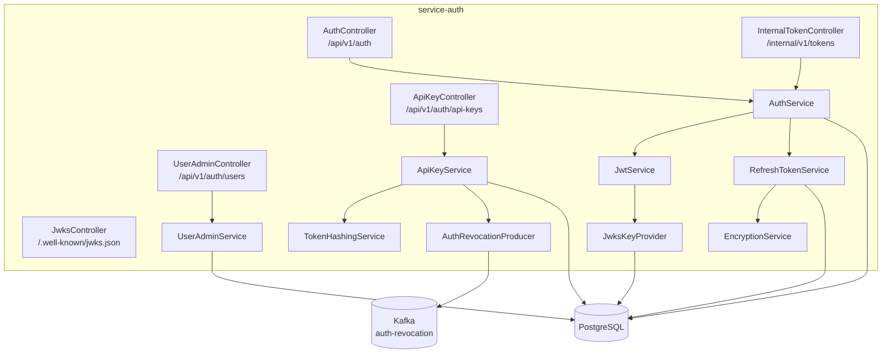

# Tài Liệu Kỹ Thuật: service-auth

## 1. Tổng Quan

**Service-auth** là dịch vụ xác thực và phân quyền trung tâm của hệ thống theo dõi bay. Mọi hoạt động đăng nhập, cấp token, quản lý API key và quản lý người dùng đều đi qua service này.

**Công nghệ sử dụng:**
- Kotlin + Spring Boot 3
- Spring Security (stateless JWT)
- PostgreSQL (lưu user, role, token, API key, signing key)
- Kafka (phát sự kiện thu hồi token/API key)
- JJWT (ký và xác minh JWT bằng RS256)
- Flyway (quản lý migration database)
- Micrometer + Prometheus (metrics)

**Port mặc định:** `8081`

---

## 2. Kiến Trúc



---

## 3. Cấu Trúc Package

```
service-auth/src/main/kotlin/com/tracking/auth/
├── AuthApplication.kt              # Entry point
├── api/
│   ├── AuthController.kt           # Đăng ký, đăng nhập, refresh, logout
│   ├── AuthService.kt              # Logic xác thực chính
│   ├── AuthDtos.kt                 # 9 data class request/response
│   └── JwksController.kt           # Endpoint cung cấp JWKS public keys
├── apikey/
│   ├── ApiKeyController.kt         # Tạo và thu hồi API key
│   ├── ApiKeyService.kt            # Logic tạo, xác minh, thu hồi
│   ├── ApiKeyEntity.kt             # JPA entity cho bảng api_keys
│   └── ApiKeyRepository.kt         # Spring Data JPA repository
├── admin/
│   ├── UserAdminController.kt      # Quản lý người dùng (ADMIN only)
│   └── UserAdminService.kt         # Logic phân trang, bật/tắt user
├── config/
│   └── SecurityConfig.kt           # Cấu hình Spring Security + RBAC
├── events/
│   └── AuthRevocationProducer.kt   # Phát sự kiện thu hồi qua Kafka
├── internal/
│   ├── InternalApiKeyAuthenticationFilter.kt  # Xác thực gateway bằng internal key
│   ├── InternalApiKeyController.kt  # Xác minh API key cho gateway
│   ├── InternalRequestSecurity.kt   # Helper bảo mật nội bộ
│   └── InternalTokenController.kt   # Xác minh JWT cho gateway
├── security/
│   ├── EncryptionService.kt         # Mã hóa AES cho refresh token
│   ├── JwksKeyProvider.kt           # Quản lý cặp khóa RSA (rotation)
│   ├── JwtAuthenticationFilter.kt   # Filter JWT trên mỗi request
│   ├── JwtService.kt               # Tạo và parse JWT (RS256)
│   ├── JwtSigningKeyEntity.kt       # Entity cho bảng jwt_signing_keys
│   ├── JwtSigningKeyRepository.kt   # Repository signing keys
│   └── TokenHashingService.kt       # Hash API key/refresh token (HMAC)
├── token/
│   ├── RefreshTokenEntity.kt        # Entity cho bảng refresh_tokens
│   ├── RefreshTokenRepository.kt    # Repository refresh tokens
│   └── RefreshTokenService.kt       # Logic cấp, xoay vòng, thu hồi refresh token
└── user/
    ├── AdminBootstrapInitializer.kt # Tự tạo admin đầu tiên khi khởi động
    ├── RoleEntity.kt                # Entity cho bảng roles
    ├── RoleRepository.kt            # Repository roles
    ├── UserEntity.kt                # Entity cho bảng users
    └── UserRepository.kt            # Repository users
```

**Tổng cộng:** 32 file source chính.

---

## 4. API Endpoints

### 4.1 Public Endpoints (không cần xác thực)

| Method | URI | Mô tả | Request Body | Response |
|---|---|---|---|---|
| POST | `/api/v1/auth/register` | Đăng ký tài khoản mới | `RegisterRequest` | `AuthTokensResponse` |
| POST | `/api/v1/auth/login` | Đăng nhập | `LoginRequest` | `AuthTokensResponse` |
| POST | `/api/v1/auth/refresh-token` | Làm mới access token | `RefreshTokenRequest` | `AuthTokensResponse` |
| GET | `/api/v1/auth/.well-known/jwks.json` | Lấy JWKS public keys | — | JWKS JSON |
| GET | `/actuator/health` | Kiểm tra sức khỏe | — | `{"status":"UP"}` |
| GET | `/actuator/prometheus` | Metrics | — | Prometheus text |

### 4.2 Admin Endpoints (cần JWT với `ROLE_ADMIN`)

| Method | URI | Mô tả | Request Body | Response |
|---|---|---|---|---|
| POST | `/api/v1/auth/api-keys` | Tạo API key mới | `CreateApiKeyRequest` | `CreateApiKeyResponse` |
| POST | `/api/v1/auth/api-keys/{id}/revoke` | Thu hồi API key | — | `204 No Content` |
| GET | `/api/v1/auth/users` | Danh sách người dùng (phân trang) | — | `UserAdminListResponse` |
| PUT | `/api/v1/auth/users/{id}/disable` | Vô hiệu hóa người dùng | — | `204 No Content` |
| PUT | `/api/v1/auth/users/{id}/enable` | Kích hoạt lại người dùng | — | `204 No Content` |

### 4.3 Internal Endpoints (cần `x-internal-api-key` header)

| Method | URI | Mô tả | Request Body | Response |
|---|---|---|---|---|
| POST | `/internal/v1/tokens/verify` | Gateway xác minh JWT | `TokenVerifyRequest` | `TokenVerifyResponse` |
| POST | `/internal/v1/api-keys/verify` | Gateway xác minh API key | `ApiKeyVerifyRequest` | `ApiKeyVerifyResponse` |

---

## 5. Cấu Trúc Dữ Liệu (DTOs)

### Request

| DTO | Trường | Validation |
|---|---|---|
| `RegisterRequest` | `username`, `email`, `password` | `@NotBlank`, `@Email`, `@Size(min=12)`, regex phức tạp |
| `LoginRequest` | `username`, `password` | `@NotBlank` |
| `RefreshTokenRequest` | `refreshToken` | `@NotBlank` |
| `LogoutRequest` | `refreshToken` | `@NotBlank` |
| `CreateApiKeyRequest` | `sourceId` | `@NotBlank` |
| `TokenVerifyRequest` | `token` | `@NotBlank` |
| `ApiKeyVerifyRequest` | `apiKey` | `@NotBlank` |

### Response

| DTO | Trường |
|---|---|
| `AuthTokensResponse` | `accessToken`, `refreshToken` |
| `CreateApiKeyResponse` | `id`, `sourceId`, `apiKey`, `active` |
| `TokenVerifyResponse` | `valid`, `username?`, `roles` |
| `ApiKeyVerifyResponse` | `valid`, `sourceId?` |

---

## 6. Kafka Topics

| Topic | Vai trò | Key | Value |
|---|---|---|---|
| `auth-revocation` | **Produce** — Phát sự kiện thu hồi | `api-key:{id}` hoặc `user:{username}` | JSON `{type, id/username, timestamp}` |

**Loại sự kiện:**
- `API_KEY_REVOKED` — khi admin thu hồi API key
- `USER_TOKENS_REVOKED` — khi user bị vô hiệu hóa hoặc logout

**Consumer:** Gateway, Ingestion, Broadcaster đều lắng nghe topic này để chặn token/key đã bị thu hồi.

---

## 7. Database Schema

### Bảng `users`

| Cột | Kiểu | Mô tả |
|---|---|---|
| `id` | BIGSERIAL | Khóa chính |
| `username` | VARCHAR(255) UNIQUE | Tên đăng nhập |
| `email` | VARCHAR(255) UNIQUE | Email |
| `password_hash` | VARCHAR(255) | Mật khẩu đã hash (BCrypt) |
| `enabled` | BOOLEAN | Trạng thái kích hoạt |
| `failed_login_attempts` | INTEGER | Số lần đăng nhập thất bại |
| `locked_until` | TIMESTAMP | Thời điểm mở khóa |
| `last_login_at` | TIMESTAMP | Lần đăng nhập gần nhất |

### Bảng `roles`

| Cột | Kiểu | Mô tả |
|---|---|---|
| `id` | BIGSERIAL | Khóa chính |
| `name` | VARCHAR(255) UNIQUE | Tên role (`ROLE_USER`, `ROLE_ADMIN`) |

### Bảng `api_keys`

| Cột | Kiểu | Mô tả |
|---|---|---|
| `id` | BIGSERIAL | Khóa chính |
| `key_hash` | VARCHAR(255) | Hash HMAC của API key |
| `source_id` | VARCHAR(255) | Mã nguồn radar |
| `active` | BOOLEAN | Còn hoạt động không |
| `revoked_at` | TIMESTAMP | Thời điểm thu hồi |

### Bảng `refresh_tokens`

| Cột | Kiểu | Mô tả |
|---|---|---|
| `id` | BIGSERIAL | Khóa chính |
| `token_hash` | VARCHAR(255) UNIQUE | Hash HMAC của refresh token |
| `encrypted_jwt` | TEXT | JWT refresh token đã mã hóa AES |
| `user_id` | BIGINT FK → users | Người dùng sở hữu |
| `revoked` | BOOLEAN | Đã thu hồi chưa |

### Bảng `jwt_signing_keys`

| Cột | Kiểu | Mô tả |
|---|---|---|
| `id` | BIGSERIAL | Khóa chính |
| `kid` | VARCHAR(255) UNIQUE | Key ID dùng trong JWT header |
| `private_key_pem` | TEXT | RSA private key (PEM, mã hóa AES) |
| `public_key_pem` | TEXT | RSA public key (PEM) |
| `active` | BOOLEAN | Đang dùng để ký |
| `created_at` | TIMESTAMP | Thời điểm tạo |

---

## 8. Mô Hình Bảo Mật

### 8.1 JWT (RS256)

- **Thuật toán ký:** RS256 (RSA 2048-bit)
- **Access token TTL:** 15 phút (mặc định `900s`)
- **Refresh token TTL:** 14 ngày (mặc định `1,209,600s`)
- **Claims chính:** `sub` (username), `roles` (danh sách role), `iss` (tracking-auth), `kid` (key ID)
- **JWKS endpoint:** Các service khác download public key từ `/.well-known/jwks.json` để xác minh token offline (không gọi lại auth-service)

### 8.2 Key Rotation

- Service auth lưu tối đa 5 cặp khóa RSA (`max-retained-keys`)
- Khi tạo khóa mới, khóa cũ vẫn giữ lại để xác minh token đã phát
- JWKS endpoint trả về tất cả public key đang hoạt động

### 8.3 Refresh Token Rotation

- Mỗi lần dùng refresh token, token cũ bị thu hồi và cấp token mới
- **Phát hiện tái sử dụng (reuse detection):** Nếu token đã bị thu hồi mà bị dùng lại → thu hồi toàn bộ token của user đó

### 8.4 Account Lockout

- Đăng nhập sai **5 lần liên tiếp** → khóa tài khoản **15 phút**
- Đăng nhập thành công → reset bộ đếm

### 8.5 API Key

- Tạo bằng `SecureRandom` 24 bytes, prefix `trk_live_`
- Chỉ lưu **hash HMAC** trong database, không lưu plaintext
- Thu hồi → phát sự kiện Kafka → gateway/ingestion chặn ngay (SLA ≤ 5 giây)

### 8.6 RBAC

| Endpoint pattern | Role yêu cầu |
|---|---|
| `/api/v1/auth/api-keys/**` | `ROLE_ADMIN` |
| `/api/v1/auth/users/**` | `ROLE_ADMIN` |
| `/internal/**` | `ROLE_INTERNAL` (qua internal API key) |
| Các endpoint public | Không cần xác thực |

---

## 9. Cấu Hình

### Biến môi trường

| Biến | Mặc định | Mô tả |
|---|---|---|
| `AUTH_INTERNAL_API_KEY` | `tracking-internal-key-2026` | Khóa nội bộ để gateway gọi `/internal/**` |
| `AUTH_TOKEN_HASH_PEPPER` | `tracking-pepper-2026-very-strong` | Pepper cho hàm hash HMAC |
| `AUTH_JWT_MASTER_KEY` | `tracking-master-key-2026-32chars-long!` | Khóa chủ mã hóa private key RSA |
| `AUTH_JWT_MAX_RETAINED_KEYS` | `5` | Số lượng cặp khóa RSA giữ lại |
| `AUTH_BOOTSTRAP_ADMIN_ENABLED` | `false` | Bật tự tạo admin khi khởi động |
| `AUTH_BOOTSTRAP_ADMIN_USERNAME` | — | Username admin bootstrap |
| `AUTH_BOOTSTRAP_ADMIN_EMAIL` | — | Email admin bootstrap |
| `AUTH_BOOTSTRAP_ADMIN_PASSWORD` | — | Mật khẩu admin bootstrap |
| `SPRING_DATASOURCE_URL` | — | JDBC URL PostgreSQL |
| `SPRING_KAFKA_BOOTSTRAP_SERVERS` | `localhost:9092` | Kafka broker |

### Profiles

| Profile | Mô tả |
|---|---|
| `local` | Database local, Flyway baseline `V5`, bootstrap admin bật |
| `k8s` | Kubernetes deployment |
| (default) | Không baseline, không bootstrap |

---

## 10. Metrics & Observability

### Metrics chính (Prometheus)

| Metric | Loại | Mô tả |
|---|---|---|
| `http_server_requests_seconds` | Histogram | Thời gian xử lý HTTP request (có tag uri, method, status) |
| `spring_security_filterchains_*` | Counter/Timer | Thống kê security filters |

### Structured Logging

- Không log token, API key, password hoặc dữ liệu nhạy cảm
- Sử dụng JSON structured logging
- Log audit event khi admin thay đổi trạng thái user

### Distributed Tracing

- Nhận `traceparent`/`x-request-id` từ gateway
- Propagate vào Kafka headers khi phát sự kiện revocation

---

## 11. Xử Lý Lỗi

| HTTP Status | Tình huống |
|---|---|
| `400 Bad Request` | Dữ liệu đầu vào không hợp lệ (validation fail) |
| `401 Unauthorized` | Sai mật khẩu hoặc token không hợp lệ |
| `403 Forbidden` | Tài khoản bị khóa/vô hiệu hóa, hoặc thiếu quyền |
| `404 Not Found` | API key hoặc user không tồn tại |
| `409 Conflict` | Username hoặc email đã tồn tại khi đăng ký |

---

## 12. Test Coverage

| Loại test | Số file | Phạm vi |
|---|---|---|
| Unit test | 6+ | AuthService, ApiKeyService, UserAdminService, JwtService |
| Controller test | 3+ | AuthController, ApiKeyController, UserAdminController |
| Integration test | 2+ | Full security chain, Kafka revocation |

**Chạy test:**
```bash
./gradlew :service-auth:test
```
