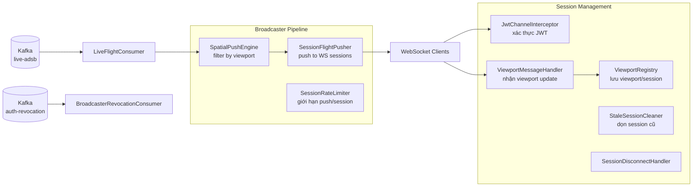

# Tài Liệu Kỹ Thuật: service-broadcaster

## 1. Tổng Quan

**Service-broadcaster** đọc bản ghi bay realtime từ Kafka topic `live-adsb` và đẩy (push) đến client qua WebSocket (STOMP). Service thực hiện:
- Lọc không gian (spatial filtering) — chỉ gửi flight trong viewport người dùng
- Bảo vệ historical — không đẩy dữ liệu lịch sử ra realtime stream
- Xác thực WebSocket handshake bằng JWT
- Quản lý session: rate limiting, stale cleanup, disconnect handling
- Thu hồi token qua Kafka

**Công nghệ:** Kotlin, Spring Boot 3, Spring WebSocket/STOMP, Kafka Consumer, Micrometer.

**Port mặc định:** `8083`

---

## 2. Kiến Trúc



---

## 3. Cấu Trúc Package

```
service-broadcaster/src/main/kotlin/com/tracking/broadcaster/
├── BroadcasterApplication.kt
├── config/
│   └── BroadcasterProperties.kt        # Cấu hình chung
├── kafka/
│   ├── BroadcasterConsumerConfig.kt     # Kafka consumer config
│   └── LiveFlightConsumer.kt            # Consumer live-adsb
├── metrics/
│   └── BroadcasterMetrics.kt            # Counter/gauge metrics
├── security/
│   ├── BroadcasterBlacklistService.kt   # Cache token bị thu hồi
│   ├── BroadcasterJwtTokenVerifier.kt   # Xác minh JWT offline
│   ├── BroadcasterRevocationConsumer.kt # Lắng nghe revocation Kafka
│   ├── BroadcasterSecurityProperties.kt # Security config
│   ├── BroadcasterTokenPrincipal.kt     # Principal cho session
│   ├── JwksCacheService.kt              # Cache JWKS public keys
│   └── JwksKeyProvider.kt               # Quản lý RSA keys
├── spatial/
│   ├── BoundingBoxMatcher.kt            # Kiểm tra point trong bounding box
│   └── SpatialPushEngine.kt             # Engine lọc theo viewport
├── tracing/
│   └── BroadcasterTraceContext.kt       # Trace context
├── viewport/
│   ├── ViewportMessageHandler.kt        # Xử lý STOMP viewport update
│   └── ViewportRegistry.kt              # Lưu trạng thái viewport mỗi session
└── ws/
    ├── BroadcasterWsRuntimeConfig.kt    # WebSocket runtime config
    ├── JwtChannelInterceptor.kt         # Xác thực JWT khi connect
    ├── SessionDisconnectHandler.kt      # Xử lý disconnect
    ├── SessionFlightPusher.kt           # Gửi flight data qua STOMP
    ├── SessionPushService.kt            # Quản lý push service
    ├── SessionRateLimiter.kt            # Rate limit per session
    ├── StaleSessionCleaner.kt           # Dọn session timeout
    └── WebSocketConfig.kt               # STOMP broker config
```

**Tổng cộng:** 25 file source.

---

## 4. WebSocket Protocol

### Kết nối

```
ws://gateway:8080/ws/live/adsb
Header: Authorization: Bearer <JWT>
```

### STOMP Destinations

| Destination | Hướng | Mô tả |
|---|---|---|
| `/topic/adsb/live` | Server → Client | Nhận flight data realtime |
| `/app/viewport` | Client → Server | Gửi viewport bounding box |

### Viewport Message

```json
{
  "minLat": 20.5,
  "maxLat": 21.5,
  "minLon": 105.0,
  "maxLon": 106.5
}
```

Client gửi viewport → server chỉ push flight nằm trong bounding box đó.

---

## 5. Kafka Topics

| Topic | Vai trò | Key | Value |
|---|---|---|---|
| `live-adsb` | **Consume** | ICAO | JSON bản ghi realtime |
| `auth-revocation` | **Consume** | — | Sự kiện thu hồi token |

---

## 6. Spatial Filtering

```
Flight(lat=21.0, lon=105.8) ∈ Viewport(minLat=20.5, maxLat=21.5, minLon=105.0, maxLon=106.5) → PUSH ✅
Flight(lat=10.8, lon=106.6) ∉ Viewport → SKIP ❌
```

- Mỗi session có viewport riêng
- Session không có viewport → không nhận flight nào
- Viewport update realtime khi user zoom/pan bản đồ

---

## 7. Bảo Mật

| Feature | Mô tả |
|---|---|
| JWT handshake | `JwtChannelInterceptor` xác minh JWT khi WebSocket CONNECT |
| JWKS cache | Download public key từ auth, cache và refresh định kỳ |
| Token revocation | Lắng nghe `auth-revocation`, chặn session bị thu hồi |
| Session rate limit | Giới hạn số message push per session per giây |
| Historical guard | `LiveFlightConsumer` chỉ forward bản ghi từ `live-adsb`, không historical |

---

## 8. Metrics

| Metric | Loại | Mô tả |
|---|---|---|
| `ws_sessions_active` | Gauge | Số session WebSocket đang kết nối |
| `ws_push_latency_seconds` | Histogram | Thời gian push message |
| `ws_viewport_updates` | Counter | Số lần client cập nhật viewport |
| `ws_messages_pushed_total` | Counter | Tổng message đã push |

---

## 9. Cấu Hình

| Biến | Mặc định | Mô tả |
|---|---|---|
| `SPRING_KAFKA_BOOTSTRAP_SERVERS` | `localhost:9092` | Kafka broker |
| `AUTH_JWKS_URI` | `http://service-auth:8081/.../jwks.json` | JWKS endpoint |
| `TRACKING_BROADCASTER_SESSION_TIMEOUT_SECONDS` | `300` | Stale session timeout |
| `TRACKING_BROADCASTER_PUSH_RATE_LIMIT` | `10` | Messages/giây/session |

---

## 10. Test Coverage

```bash
./gradlew :service-broadcaster:test
```

| Loại | Phạm vi |
|---|---|
| Unit test | SpatialPushEngine, SessionRateLimiter, JwtChannelInterceptor, ViewportRegistry |
| Integration test | BroadcasterWebSocketIT, LiveFlightConsumerTest |
