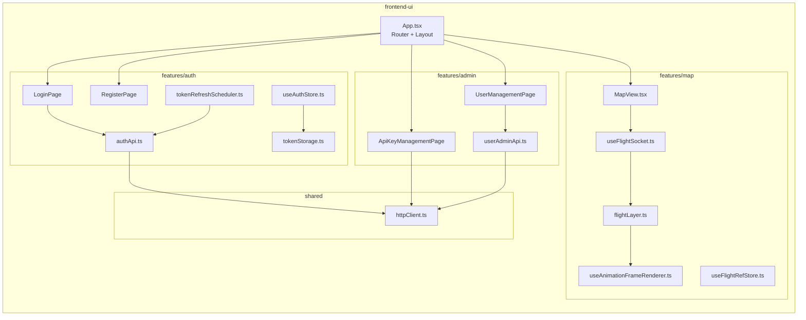

# Tài Liệu Kỹ Thuật: frontend-ui

## 1. Tổng Quan

**Frontend-ui** là ứng dụng web hiển thị bản đồ theo dõi bay realtime. Giao diện cho phép:
- Đăng nhập / đăng ký tài khoản
- Xem bản đồ với máy bay cập nhật realtime qua WebSocket
- Quản lý API key (admin)
- Quản lý người dùng (admin)

**Công nghệ:** React, TypeScript, Vite, Tailwind CSS, Zustand (state management), SockJS/STOMP (WebSocket), Leaflet/MapLibre (bản đồ), Vitest (testing).

**Port dev:** `5173`

---

## 2. Kiến Trúc



---

## 3. Cấu Trúc File

```
frontend-ui/src/
├── App.tsx                          # Router chính
├── main.tsx                         # Entry point
├── styles.css                       # Tailwind CSS
├── vite-env.d.ts                    # TypeScript declarations
├── features/
│   ├── auth/
│   │   ├── api/
│   │   │   └── authApi.ts           # Gọi register, login, refresh, logout
│   │   ├── pages/
│   │   │   ├── LoginPage.tsx        # Trang đăng nhập
│   │   │   └── RegisterPage.tsx     # Trang đăng ký
│   │   ├── security/
│   │   │   ├── tokenStorage.ts      # Lưu token vào memory (không localStorage)
│   │   │   ├── tokenRefreshScheduler.ts # Tự refresh token trước hạn
│   │   │   └── tokenStorage.test.ts
│   │   └── store/
│   │       ├── useAuthStore.ts      # Zustand store auth state
│   │       └── useAuthStore.test.ts
│   ├── map/
│   │   ├── components/
│   │   │   └── MapView.tsx          # Component bản đồ chính
│   │   ├── hooks/
│   │   │   ├── useFlightSocket.ts   # Hook kết nối WebSocket STOMP
│   │   │   └── useFlightSocket.test.ts
│   │   ├── render/
│   │   │   ├── flightLayer.ts       # Render flight markers trên map
│   │   │   ├── useAnimationFrameRenderer.ts  # requestAnimationFrame loop
│   │   │   └── flightLayer.test.ts
│   │   └── store/
│   │       └── useFlightRefStore.ts # Zustand store flight data (ref-based)
│   └── admin/
│       ├── api/
│       │   ├── userAdminApi.ts      # Gọi API quản lý user
│       │   └── userAdminApi.test.ts
│       └── pages/
│           ├── ApiKeyManagementPage.tsx  # Quản lý API key
│           ├── UserManagementPage.tsx    # Quản lý user (phân trang, bật/tắt)
│           └── UserManagementPage.test.tsx
├── shared/
│   └── api/
│       └── httpClient.ts            # Axios instance + interceptors
└── test/
    └── setup.ts                     # Vitest setup
```

**Tổng cộng:** 26 file source.

---

## 4. Luồng Dữ Liệu Chính

### 4.1 Đăng nhập

```
LoginPage → authApi.login() → httpClient POST /api/v1/auth/login
→ Nhận accessToken + refreshToken
→ tokenStorage lưu vào memory
→ useAuthStore cập nhật trạng thái
→ tokenRefreshScheduler lên lịch refresh trước hạn
→ Chuyển trang đến MapView
```

### 4.2 Bản đồ realtime

```
MapView mount → useFlightSocket kết nối WebSocket
→ Gửi viewport (bounding box của map view)
→ Nhận flight data qua STOMP /topic/adsb/live
→ useFlightRefStore cập nhật Map<icao, FlightData>
→ useAnimationFrameRenderer render markers mỗi frame
→ User zoom/pan → gửi viewport mới
```

### 4.3 Token refresh

```
tokenRefreshScheduler chạy setInterval
→ Kiểm tra access token còn > 2 phút trước hạn
→ Nếu sắp hết → gọi authApi.refresh()
→ Cập nhật tokenStorage với token mới
→ Transparent — user không biết
```

---

## 5. Bảo Mật

| Feature | Cách triển khai |
|---|---|
| Token storage | **Memory only** — không localStorage, không cookie (XSS-safe) |
| Auto refresh | Refresh trước khi hết hạn, hoàn toàn trong background |
| No token logging | Không console.log token vào DevTools |
| CORS | Gateway cho phép origin `http://localhost:5173` |
| JWT in WS | Gửi JWT trong header khi connect WebSocket |

---

## 6. Render Performance

### Animation Frame Renderer

Thay vì re-render React component mỗi khi có flight update (có thể hàng trăm lần/giây), frontend dùng **requestAnimationFrame**:
- Flight data lưu trong Zustand ref store (không trigger re-render)
- `useAnimationFrameRenderer` loop 60fps, batch update markers
- `flightLayer` render trực tiếp trên map canvas

Cơ chế này giúp map mượt với 1000+ flights cập nhật liên tục.

---

## 7. State Management (Zustand)

| Store | Mục đích | Kiểu |
|---|---|---|
| `useAuthStore` | Auth state (user, token, isAuthenticated) | Regular Zustand |
| `useFlightRefStore` | Flight data map | Ref-based (không trigger re-render) |

---

## 8. HTTP Client

`httpClient.ts` là Axios instance dùng chung:
- Base URL: gateway (`http://localhost:8080`)
- Request interceptor: tự thêm `Authorization` header
- Response interceptor: handle 401 → redirect đăng nhập

---

## 9. Test Coverage

```bash
cd frontend-ui
npm test
```

| Loại | Phạm vi |
|---|---|
| Unit test | tokenStorage, useAuthStore, flightLayer, useFlightSocket, userAdminApi |
| Component test | UserManagementPage |
