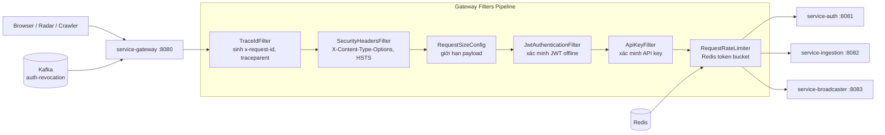

# Tài Liệu Kỹ Thuật: service-gateway

## 1. Tổng Quan

**Service-gateway** là cổng vào duy nhất của hệ thống. Mọi request từ bên ngoài (browser, radar, crawler) đều phải đi qua gateway. Service này chịu trách nhiệm:
- Định tuyến request đến đúng service nội bộ
- Xác thực JWT và API key
- Giới hạn tốc độ (rate limiting)
- Bảo vệ bằng security headers
- Kiểm soát kích thước payload
- Circuit breaker cho downstream dependencies
- Propagate trace context (traceparent, x-request-id)

**Công nghệ:** Kotlin, Spring Cloud Gateway (reactive), Redis (rate limiting), Resilience4j (circuit breaker), Kafka (nhận sự kiện thu hồi), Micrometer.

**Port mặc định:** `8080`

---

## 2. Kiến Trúc



---

## 3. Cấu Trúc Package

```
service-gateway/src/main/kotlin/com/tracking/gateway/
├── GatewayApplication.kt
├── config/
│   ├── CorsConfig.kt               # Cấu hình CORS tập trung
│   ├── GatewayRoutesConfig.kt      # Route patterns + path matching
│   ├── RateLimiterConfig.kt        # 3 key resolvers (IP, API key, user)
│   ├── RedisConfig.kt              # Redis connection cho rate limiting
│   ├── RequestSizeConfig.kt        # Giới hạn kích thước request per-path
│   ├── ResilienceConfig.kt         # Circuit breaker + WebClient timeout
│   ├── SecurityHeadersFilter.kt    # Security headers (X-Frame-Options, etc.)
│   ├── TlsConfig.kt               # Chuyển hướng HTTPS
│   └── TrustedProxyConfig.kt       # Lấy IP thật qua X-Forwarded-For
├── filter/
│   ├── ApiKeyFilter.kt             # Xác minh API key cho /ingest/**
│   ├── JwtAuthenticationFilter.kt  # Xác minh JWT cho /auth/**, /ws/**
│   └── TraceIdFilter.kt            # Sinh trace ID end-to-end
└── security/
    ├── ApiKeyVerificationService.kt # Gọi auth để verify API key
    ├── BlacklistService.kt          # Cache token/key bị thu hồi
    ├── JwksCacheService.kt          # Cache JWKS public keys
    ├── JwtTokenVerifier.kt          # Xác minh JWT offline bằng JWKS
    ├── RevocationKafkaConsumer.kt   # Lắng nghe sự kiện thu hồi
    └── TokenVerifier.kt             # Interface chung cho token verify
```

**Tổng cộng:** 19 file source.

---

## 4. Bảng Định Tuyến

| Route ID | Path | Upstream | Rate Limit Key | Rate Limit |
|---|---|---|---|---|
| `auth-login-route` | `/api/v1/auth/login` | service-auth:8081 | IP | 5 req/s, burst 10 |
| `auth-route` | `/api/v1/auth/**` | service-auth:8081 | IP | 200 req/s, burst 400 |
| `ingest-route` | `/api/v1/ingest/**` | service-ingestion:8082 | API key | 100k req/s, burst 120k |
| `ws-live-route` | `/ws/live/**` | service-broadcaster:8083 | User/IP | 20 req/s, burst 40 |

---

## 5. Bảo Mật

### 5.1 Xác thực

| Path | Phương thức xác thực | Mô tả |
|---|---|---|
| `/api/v1/auth/login`, `/register`, `/refresh-token`, `/.well-known/jwks.json` | Không | Public endpoints |
| `/api/v1/auth/**` (còn lại) | JWT Bearer | Admin endpoints |
| `/api/v1/ingest/**` | API key (`x-api-key` header) | Nguồn radar |
| `/ws/live/**` | JWT Bearer | WebSocket |
| `/actuator/health`, `/actuator/prometheus` | Không | Health/metrics |

### 5.2 Security Headers

Mỗi response đều được thêm:
- `X-Content-Type-Options: nosniff`
- `X-Frame-Options: DENY`
- `X-XSS-Protection: 1; mode=block`
- `Cache-Control: no-store`
- `Strict-Transport-Security` (khi HTTPS)

### 5.3 Giới hạn kích thước request

| Path | Giới hạn |
|---|---|
| `/api/v1/ingest/**` | 256 KB |
| `/api/v1/auth/**` | 64 KB |
| Mặc định | 1 MB |

Vượt giới hạn → trả về `413 Payload Too Large`.

### 5.4 CORS

- Allowed origins: `http://localhost:5173` (frontend dev)
- Exposed headers: `x-request-id`, `traceparent`
- Cấu hình tại `tracking.gateway.cors.*`

### 5.5 Thu hồi (Revocation)

Gateway lắng nghe Kafka topic `auth-revocation` để nhận biết token/API key bị thu hồi:
- **API key bị thu hồi:** Lưu vào blacklist cache, chặn request tiếp theo
- **User tokens bị thu hồi:** Lưu username vào blacklist, chặn JWT của user đó
- **TTL cache:** Token 15 phút, API key 15 phút (tương ứng token lifetime)

---

## 6. Kafka Topics

| Topic | Vai trò | Key | Value |
|---|---|---|---|
| `auth-revocation` | **Consume** — Nhận sự kiện thu hồi | `api-key:{id}` / `user:{username}` | JSON |

---

## 7. Circuit Breaker

| Instance | Đối tượng bảo vệ | Window | Failure Rate | Wait (Open→HalfOpen) |
|---|---|---|---|---|
| `auth-jwks` | Gọi JWKS endpoint | 20 calls | 50% | 10 giây |
| `auth-api-key` | Gọi verify API key | 50 calls | 50% | 5 giây |

Khi circuit breaker mở → gateway trả lỗi deterministic thay vì đợi timeout.

---

## 8. Cấu Hình Quan Trọng

| Biến | Mặc định | Mô tả |
|---|---|---|
| `GATEWAY_ROUTE_AUTH_URI` | `http://service-auth:8081` | URI upstream service-auth |
| `GATEWAY_ROUTE_INGEST_URI` | `http://service-ingestion:8082` | URI upstream ingestion |
| `GATEWAY_ROUTE_WS_URI` | `ws://service-broadcaster:8083` | URI upstream WebSocket |
| `AUTH_JWKS_URI` | `http://service-auth:8081/.../jwks.json` | Endpoint JWKS |
| `AUTH_INTERNAL_API_KEY` | `tracking-internal-key-2026` | Khóa nội bộ gọi auth |
| `GATEWAY_ENFORCE_HTTPS` | `false` | Bật chuyển hướng HTTPS |
| `GATEWAY_JWKS_REFRESH_INTERVAL_SECONDS` | `300` | Chu kỳ refresh JWKS (giây) |
| `KAFKA_BOOTSTRAP_SERVERS` | `localhost:9092` | Kafka broker |

---

## 9. Metrics

| Metric | Loại | Mô tả |
|---|---|---|
| `http_server_requests_seconds` | Histogram | Latency HTTP theo URI/status |
| `resilience4j_circuitbreaker_state` | Gauge | Trạng thái circuit breaker |
| `resilience4j_circuitbreaker_calls_seconds` | Timer | Thời gian gọi downstream |

---

## 10. Test Coverage

| Loại | Phạm vi |
|---|---|
| Filter test | JwtAuthenticationFilter, ApiKeyFilter, TraceIdFilter, SecurityHeadersFilter |
| Config test | RateLimiterConfig, RequestSizeConfig, ResilienceConfig |
| Security test | JwksCacheService, BlacklistService, RevocationKafkaConsumer |
| Integration test | GatewayHardeningIT (end-to-end filter chain) |

```bash
./gradlew :service-gateway:test
```
