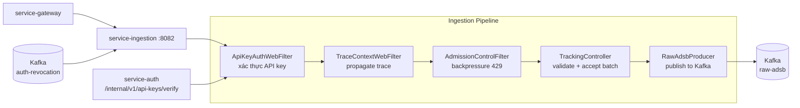

# Tài Liệu Kỹ Thuật: service-ingestion

## 1. Tổng Quan

**Service-ingestion** nhận dữ liệu ADS-B từ nguồn radar/crawler qua HTTP API, xác thực bằng API key, validate dữ liệu, rồi đẩy vào Kafka topic `raw-adsb` để các service downstream xử lý.

**Công nghệ:** Kotlin, Spring Boot 3 (WebFlux reactive), Kafka Producer, Micrometer.

**Port mặc định:** `8082`

---

## 2. Kiến Trúc



---

## 3. Cấu Trúc Package

```
service-ingestion/src/main/kotlin/com/tracking/ingestion/
├── IngestionApplication.kt
├── api/
│   ├── TrackingController.kt         # Endpoint batch ingest
│   ├── IngestBatchRequest.kt         # DTO request (records array)
│   ├── IngestBatchResponse.kt        # DTO response
│   ├── IngestFlightRequest.kt        # DTO mỗi bản ghi bay
│   ├── IngestRequestValidator.kt     # Validate lat/lon/speed/icao
│   ├── AdmissionControlFilter.kt     # Backpressure filter (429)
│   ├── GlobalExceptionHandler.kt     # Xử lý lỗi toàn cục
│   ├── IngestAcceptedResponse.kt     # Response 202
│   ├── IngestionErrorResponse.kt     # Response lỗi
│   └── IngestionExceptions.kt        # Custom exceptions
├── config/
│   ├── BackpressureConfig.kt         # Cấu hình admission control
│   └── IngestionProperties.kt        # Properties chung
├── filter/
│   └── TraceContextWebFilter.kt      # Inject traceparent vào context
├── kafka/
│   ├── RawAdsbProducer.kt            # Kafka producer (batching, lz4)
│   ├── RecordKeyStrategy.kt          # Key = ICAO (đảm bảo ordering)
│   └── KafkaTopicProperties.kt       # Tên topic config
├── lifecycle/
│   └── IngestionShutdownHook.kt      # Flush producer khi shutdown
├── metrics/
│   └── IngestionMetrics.kt           # Counter/gauge metrics
├── security/
│   ├── ApiKeyAuthWebFilter.kt        # Xác thực API key per request
│   ├── ApiKeyCacheService.kt         # Cache API key verify result
│   ├── ApiKeyPrincipal.kt            # Principal cho authenticated key
│   ├── ApiKeyRevocationConsumer.kt   # Lắng nghe revocation events
│   └── AuthServiceClient.kt         # Gọi auth verify API key
└── tracing/
    └── TraceContextExtractor.kt      # Extract trace từ headers
```

**Tổng cộng:** 25 file source.

---

## 4. API Endpoints

| Method | URI | Xác thực | Mô tả | Response |
|---|---|---|---|---|
| POST | `/api/v1/ingest/adsb/batch` | API key (`x-api-key`) | Nhận batch bản ghi ADS-B | `202 Accepted` |
| GET | `/actuator/health` | Không | Health check | `{"status":"UP"}` |
| GET | `/actuator/prometheus` | Không | Metrics | Prometheus text |

### Request Body

```json
{
  "records": [
    {
      "icao": "A1B2C3",
      "lat": 21.0285,
      "lon": 105.8542,
      "altitude": 11000,
      "speed": 780,
      "heading": 45,
      "event_time": 1709280000000,
      "source_id": "RADAR-HN"
    }
  ]
}
```

### Validation Rules

| Trường | Quy tắc |
|---|---|
| `icao` | Bắt buộc, 6 ký tự hex |
| `lat` | -90 đến 90 |
| `lon` | -180 đến 180 |
| `altitude` | ≥ 0 |
| `speed` | ≥ 0 |
| `heading` | 0 đến 360 |
| `event_time` | Epoch milliseconds |

---

## 5. Kafka Topics

| Topic | Vai trò | Key | Value | Compression |
|---|---|---|---|---|
| `raw-adsb` | **Produce** | ICAO hex | JSON bản ghi bay | LZ4 |
| `auth-revocation` | **Consume** | — | Sự kiện thu hồi | — |

**Key = ICAO** đảm bảo tất cả bản ghi của cùng một máy bay nằm trên cùng partition → ordering đúng.

**Kafka Headers được inject:** `traceparent`, `x-request-id`, `x-source-id`.

---

## 6. Cơ Chế Backpressure

| Chế độ | HTTP Status | Khi nào |
|---|---|---|
| Admission reject | `429` | Số request in-flight vượt ngưỡng |
| Producer unavailable | `503` | Kafka producer timeout hoặc lỗi |
| Validation fail | `400` | Dữ liệu không hợp lệ |
| Auth fail | `401` | API key không hợp lệ hoặc bị thu hồi |

---

## 7. Metrics

| Metric | Loại | Mô tả |
|---|---|---|
| `tracking_ingestion_accepted_batch_records_total` | Counter | Tổng bản ghi được chấp nhận |
| `tracking_ingestion_kafka_published_total` | Counter | Tổng bản ghi đã publish Kafka |
| `tracking_ingestion_rejected_auth_total` | Counter | Bản ghi bị từ chối do auth |
| `tracking_ingestion_rejected_admission_total` | Counter | Bản ghi bị từ chối do backpressure |
| `tracking_ingestion_rejected_producer_unavailable_total` | Counter | Bản ghi bị từ chối do Kafka lỗi |
| `tracking_ingestion_rejected_validation_total` | Counter | Bản ghi bị validation reject |

---

## 8. Graceful Shutdown

`IngestionShutdownHook` đảm bảo khi service tắt:
1. Dừng nhận request mới
2. Gọi `KafkaTemplate.flush()` để đẩy hết message đang buffer
3. Chờ tối đa `terminationGracePeriodSeconds` (30 giây)

---

## 9. Cấu Hình

| Biến | Mặc định | Mô tả |
|---|---|---|
| `SPRING_KAFKA_BOOTSTRAP_SERVERS` | `localhost:9092` | Kafka broker |
| `AUTH_SERVICE_BASE_URL` | `http://service-auth:8081` | Auth service URL |
| `AUTH_INTERNAL_API_KEY` | `tracking-internal-key-2026` | API key nội bộ |
| `TRACKING_INGESTION_MAX_BATCH_SIZE` | `1000` | Giới hạn số bản ghi per batch |

---

## 10. Test Coverage

```bash
./gradlew :service-ingestion:test
```

| Loại | Phạm vi |
|---|---|
| Unit test | Validator, Metrics, RecordKeyStrategy |
| Controller test | BatchIngestController, error responses |
| Integration test | KafkaBackpressureIT, ProducerTimeoutIT, ShutdownFlushIT, KafkaHeadersPropagationTest, PartitionKeyingIT |
