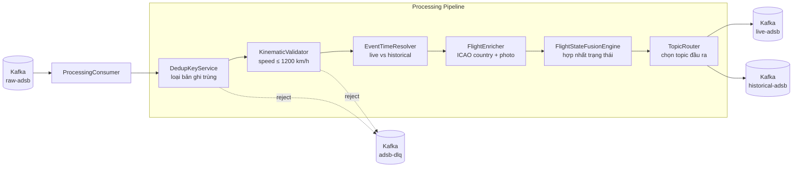

# Tài Liệu Kỹ Thuật: service-processing

## 1. Tổng Quan

**Service-processing** xử lý dữ liệu bay thô từ Kafka topic `raw-adsb`, thực hiện:
- Loại bỏ bản ghi trùng lặp (dedup)
- Xác thực động học (kinematic validation — tốc độ, khoảng cách)
- Phân loại sự kiện thời gian (live vs historical)
- Làm giàu dữ liệu (enrichment: quốc gia ICAO, ảnh máy bay)
- Routing kết quả sang topic phù hợp

**Công nghệ:** Kotlin, Spring Boot 3, Kafka Consumer/Producer, Redis (dedup cache), Micrometer.

**Port mặc định:** `8085`

---

## 2. Kiến Trúc



---

## 3. Cấu Trúc Package

```
service-processing/src/main/kotlin/com/tracking/processing/
├── ProcessingApplication.kt
├── dedup/
│   ├── DedupCacheConfig.kt           # Cấu hình Redis cache dedup
│   └── DedupKeyService.kt            # Kiểm tra trùng lặp (ICAO + timestamp)
├── engine/
│   └── FlightStateFusionEngine.kt    # Hợp nhất state: tốc độ, vị trí, heading
├── enrich/
│   ├── FlightEnricher.kt             # Orchestrator enrichment
│   ├── IcaoCountryResolver.kt        # Map ICAO prefix → quốc gia
│   ├── PlanespottersPhotoProvider.kt  # URL ảnh máy bay
│   ├── ReferenceDataCache.kt         # Cache dữ liệu tham chiếu
│   └── ReferenceDataLoader.kt        # Tải dữ liệu tham chiếu lúc startup
├── eventtime/
│   └── EventTimeResolver.kt          # Quyết định live (≤ 30s) hay historical
├── geo/
│   └── Haversine.kt                  # Tính khoảng cách giữa 2 tọa độ
├── kafka/
│   ├── InvalidRecordDlqProducer.kt   # Gửi bản ghi lỗi tới DLQ
│   ├── ProcessingConsumerConfig.kt   # Kafka consumer config
│   └── ProcessingProducer.kt         # Kafka producer cho output topics
├── metrics/
│   └── ProcessingMetrics.kt          # Counter/histogram metrics
├── pipeline/
│   ├── FlightProcessingStage.kt      # Interface stage trong pipeline
│   └── PipelineExecutor.kt           # Thực thi chuỗi stage
├── routing/
│   └── TopicRouter.kt                # Chọn live-adsb hoặc historical-adsb
├── state/
│   └── LastKnownStateStore.kt        # Lưu trạng thái cuối cùng mỗi ICAO
├── tracing/
│   └── ProcessingTraceContext.kt     # Propagate trace context
└── validation/
    └── KinematicValidator.kt         # Speed ≤ 1200 km/h, distance hợp lý
```

**Tổng cộng:** 21 file source.

---

## 4. Pipeline Stages

| Thứ tự | Stage | Hành vi | Kết quả lỗi |
|---|---|---|---|
| 1 | `DedupKeyService` | Kiểm tra `ICAO + event_time` trong Redis cache | Bỏ qua (counter tăng) |
| 2 | `KinematicValidator` | Speed ≤ 1200 km/h, khoảng cách hợp lý với state trước | Gửi DLQ + counter |
| 3 | `EventTimeResolver` | So `event_time` với `now()`, nếu chênh > 30s → historical | Phân loại |
| 4 | `FlightEnricher` | Thêm country code từ ICAO prefix, URL ảnh | Giữ nguyên nếu không tìm được |
| 5 | `FlightStateFusionEngine` | Cập nhật state: vị trí, tốc độ, heading | State store |
| 6 | `TopicRouter` | Gửi live → `live-adsb`, historical → `historical-adsb` | — |

---

## 5. Kafka Topics

| Topic | Vai trò | Key | Value |
|---|---|---|---|
| `raw-adsb` | **Consume** | ICAO | JSON bản ghi thô |
| `live-adsb` | **Produce** | ICAO | JSON bản ghi đã xử lý (realtime) |
| `historical-adsb` | **Produce** | ICAO | JSON bản ghi đã xử lý (historical) |
| `adsb-dlq` | **Produce** | ICAO | Bản ghi không hợp lệ (kinematic fail) |

---

## 6. Quy Tắc Kinematic

| Quy tắc | Ngưỡng | Hành vi |
|---|---|---|
| Tốc độ tối đa | 1,200 km/h | Vượt → DLQ |
| Khoảng cách bất thường | Haversine so với state trước | Kiểm tra tốc độ implied |

Công thức Haversine tính toán khoảng cách giữa 2 điểm GPS (latitude, longitude) trên bề mặt Trái Đất.

---

## 7. Enrichment

### ICAO Country

Dựa vào 3 ký tự đầu ICAO hex map ra quốc gia đăng ký máy bay. Bảng lookup được tải lúc startup từ file tham chiếu.

### Planespotters Photo

Tra cứu URL ảnh máy bay từ Planespotters API dựa trên ICAO. Kết quả được cache để giảm số lượng request bên ngoài.

---

## 8. Metrics

| Metric | Loại | Mô tả |
|---|---|---|
| `tracking_processing_pipeline_latency_seconds` | Histogram | Thời gian xử lý toàn pipeline |
| `tracking_processing_published_live_total` | Counter | Bản ghi live đã publish |
| `tracking_processing_published_historical_total` | Counter | Bản ghi historical đã publish |
| `tracking_processing_published_dlq_total` | Counter | Bản ghi gửi DLQ |
| `tracking_processing_pipeline_dropped_duplicate_total` | Counter | Bản ghi trùng bị loại |
| `tracking_processing_pipeline_rejected_kinematic_total` | Counter | Bản ghi kinematic fail |

---

## 9. Cấu Hình

| Biến | Mặc định | Mô tả |
|---|---|---|
| `SPRING_KAFKA_BOOTSTRAP_SERVERS` | `localhost:9092` | Kafka broker |
| `SPRING_DATA_REDIS_HOST` | `localhost` | Redis cho dedup cache |
| `TRACKING_PROCESSING_LIVE_THRESHOLD_SECONDS` | `30` | Ngưỡng live vs historical |
| `TRACKING_PROCESSING_MAX_SPEED_KMH` | `1200` | Tốc độ tối đa cho phép |

---

## 10. Test Coverage

```bash
./gradlew :service-processing:test
```

| Loại | Phạm vi |
|---|---|
| Unit test | KinematicValidator, IcaoCountryResolver, EventTimeResolver, DedupKeyService |
| Integration test | FlightStateFusionEngineIT (full pipeline) |
