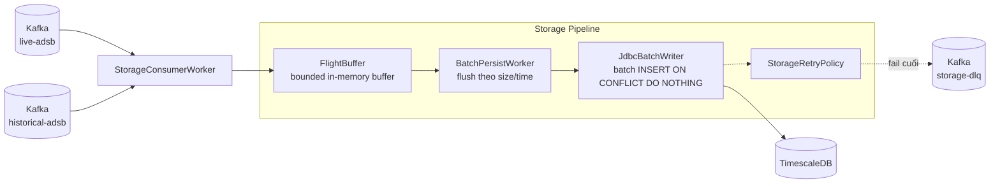

# Tài Liệu Kỹ Thuật: service-storage

## 1. Tổng Quan

`service-storage` là write-only persistence service cho dữ liệu bay đã qua xử lý.

Nó đọc từ Kafka:
- `live-adsb`
- `historical-adsb`

Sau đó:
1. đưa record vào buffer giới hạn,
2. flush theo size/time,
3. ghi batch vào TimescaleDB,
4. retry hoặc đẩy `storage-dlq` nếu persist thất bại.

**Công nghệ:** Kotlin, Spring Boot 3, Spring Kafka, Spring JDBC, PostgreSQL/TimescaleDB, Micrometer

**Port mặc định local:** `8084`

## 2. Kiến Trúc



## 3. Thành Phần Chính

```
service-storage/src/main/kotlin/com/tracking/storage/
├── buffer/FlightBuffer.kt
├── db/JdbcBatchWriter.kt
├── kafka/StorageConsumerConfig.kt
├── kafka/StorageDlqProducer.kt
├── metrics/StorageMetrics.kt
├── model/PersistableFlight.kt
├── retry/StorageRetryPolicy.kt
├── tracing/StorageTraceContext.kt
├── worker/BatchPersistWorker.kt
└── worker/StorageConsumerWorker.kt
```

Trách nhiệm:
- `StorageConsumerWorker`: consume Kafka, pause/resume khi buffer cao
- `FlightBuffer`: giữ record chờ persist
- `BatchPersistWorker`: flush theo batch size hoặc time window
- `JdbcBatchWriter`: insert batch idempotent
- `StorageRetryPolicy`: retry/backoff khi DB lỗi
- `StorageDlqProducer`: phát batch fail cuối sang `storage-dlq`
- `StorageTraceContext`: giữ `request_id` và `traceparent`

## 4. Write Path

### 4.1 Buffer và flush

Runtime hiện tại:
- `tracking.storage.consumer.concurrency = 4`
- `tracking.storage.batch.max-size = 5000`
- `tracking.storage.batch.flush-interval-millis = 5000`
- `tracking.storage.buffer.max-capacity = 100000`
- `tracking.storage.buffer.pause-threshold = 90000`
- `tracking.storage.buffer.resume-threshold = 50000`

Ý nghĩa:
- service không nhận vô hạn vào RAM,
- consumer tự pause nếu DB chậm,
- write path ưu tiên ổn định hơn là latency tuyệt đối.

### 4.2 Idempotent persist

`JdbcBatchWriter` ghi theo mẫu:

```sql
INSERT INTO flight_positions (
    icao,
    event_time,
    lat,
    lon,
    altitude,
    speed,
    heading,
    source_id,
    is_historical,
    metadata,
    request_id,
    traceparent
)
VALUES (?, ?, ?, ?, ?, ?, ?, ?, ?, ?::jsonb, ?, ?)
ON CONFLICT (icao, event_time, lat, lon) DO NOTHING
```

Tác dụng:
- replay Kafka không tạo duplicate rows,
- retry batch an toàn,
- dedup cuối cùng nằm ở DB thay vì chỉ dựa vào cache tầng trên.

## 5. Schema Storage

### 5.1 `storage.flight_positions`

| Cột | Kiểu |
|---|---|
| `icao` | `VARCHAR(6)` |
| `event_time` | `TIMESTAMPTZ` |
| `lat` | `DOUBLE PRECISION` |
| `lon` | `DOUBLE PRECISION` |
| `altitude` | `DOUBLE PRECISION` |
| `speed` | `DOUBLE PRECISION` |
| `heading` | `DOUBLE PRECISION` |
| `source_id` | `VARCHAR(64)` |
| `is_historical` | `BOOLEAN` |
| `metadata` | `JSONB` |
| `request_id` | `VARCHAR(128)` |
| `traceparent` | `VARCHAR(128)` |
| `created_at` | `TIMESTAMPTZ` |

### 5.2 Hypertable, indexes, policies

- hypertable theo `event_time`
- chunk interval hiện tại: `1 day`
- btree index: `(icao, event_time DESC)`
- btree index: `(lat, lon)`
- unique dedup index: `(icao, event_time, lat, lon)`
- compression policy: `7 days`
- retention policy raw: `90 days`

### 5.3 Quarantine

`storage.quarantine_records` giữ lại payload lỗi persist để điều tra/replay.

## 6. Kafka Contract

| Topic | Vai trò | Key | Value |
|---|---|---|---|
| `live-adsb` | consume | `icao` | JSON flight realtime |
| `historical-adsb` | consume | `icao` | JSON flight historical |
| `storage-dlq` | produce | `icao` | JSON batch lỗi persist |

Offset chỉ được ack sau khi batch persist thành công hoặc đã đi qua nhánh xử lý lỗi cuối.

## 7. Metrics

| Metric | Loại | Mục đích |
|---|---|---|
| `tracking_storage_buffer_size` | Gauge | phát hiện backlog tăng |
| `tracking_storage_rows_written_total` | Counter | đối chiếu throughput persist |
| `tracking_storage_batch_written_total` | Counter | theo dõi số batch thành công |
| `tracking_storage_batch_failed_total` | Counter | phát hiện lỗi persist |
| `tracking_storage_batch_latency_seconds` | Histogram | theo dõi p95/p99 |
| `tracking_storage_dlq_published_total` | Counter | phát hiện batch bị quarantine/DLQ |

## 8. Query Fit Và Hạn Chế

Storage hiện tại phù hợp cho:
- recent history theo `icao`,
- write throughput cao,
- replay-safe persistence.

Storage hiện tại chưa tối ưu cho:
- spatial search thật,
- metadata filtering nặng,
- analytics cross-ICAO trên raw data lớn,
- cold historical query lâu năm.

Những phần đó thuộc roadmap tiếp theo tại [storage-improvement-plan.md](/mnt/c/Users/NamP7/Documents/workspace/2026/tracking-2026/docs/storage-improvement-plan.md).

## 9. Công Cụ Phân Tích Dung Lượng

Dùng [storage-baseline.sql](/mnt/c/Users/NamP7/Documents/workspace/2026/tracking-2026/infra/postgres/storage-baseline.sql) để đo:
- table size,
- estimated rows,
- rows/day,
- chunk inventory,
- compression status,
- bytes/row estimate.

## 10. Test Coverage

```bash
./gradlew :service-storage:test
```

Phạm vi hiện tại:
- `JdbcBatchWriter`
- `BatchPersistWorker`
- `StorageConsumerWorker`
- integration test persist/idempotency
