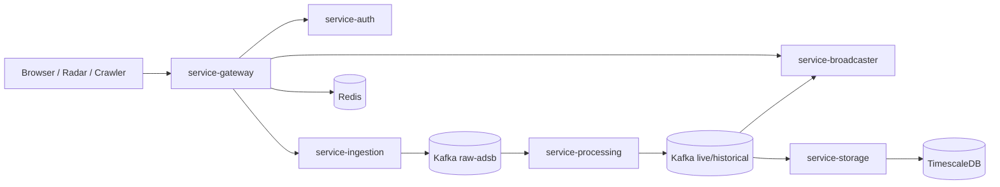

# Threat Model

## System context
- Public entrypoints:
  - `frontend-ui`
  - `service-gateway`
- Internal services:
  - `service-auth`
  - `service-ingestion`
  - `service-processing`
  - `service-storage`
  - `service-broadcaster`
- Data stores / brokers:
  - Kafka
  - PostgreSQL/TimescaleDB
  - Redis

## Trust boundaries
1. Browser / crawler / radar over public internet -> gateway.
2. Gateway -> internal services over internal network.
3. Internal services -> Kafka / Postgres / Redis.
4. CI / supply chain -> build artifacts and runtime images.

## Data flow

## STRIDE analysis

| Threat | Asset | Likelihood | Impact | Score | Mitigation | Status |
|---|---|---:|---:|---:|---|---|
| Spoofed JWT/API key | Gateway/auth plane | 3 | 5 | 15 | Offline JWT verify, API key verify, revocation propagation | Implemented |
| Tampered telemetry payload | Ingestion/raw pipeline | 3 | 4 | 12 | Structural validation, API key auth, trace IDs | Partial |
| Replay of leaked API key | Ingest endpoint | 4 | 4 | 16 | Revocation events, short cache TTL, source binding | Implemented |
| Repudiation of admin changes | Auth admin ops | 2 | 4 | 8 | Structured audit log in user admin service | Implemented |
| Sensitive data disclosure in logs | All services | 3 | 5 | 15 | Security checklist, code review, no token logging policy | Verified by review |
| DoS on login / ingest | Gateway / ingestion | 4 | 5 | 20 | Rate limiting, request size limit, backpressure, admission control | Implemented |
| WebSocket CSWSH / unauthorized subscribe | Broadcaster | 3 | 4 | 12 | JWT on STOMP CONNECT, origin allowlist, session rate limit | Implemented |
| Viewport flood / fan-out amplification | Broadcaster | 4 | 4 | 16 | Per-session viewport rate limit, spatial filtering | Implemented |
| Kafka message injection / consumer poisoning | Internal event bus | 2 | 5 | 10 | Network isolation, trusted producers only, schema-bound DTOs | Partial |
| Dependency/supply-chain compromise | CI/CD | 3 | 5 | 15 | Dependency review, Trivy, Gitleaks, dependency submission | Implemented |

## Attack-to-control mapping

| Attack vector | Controls |
|---|---|
| Flood `/api/v1/auth/login` | Gateway per-IP rate limit, circuit breaker, metrics alerts |
| Replay leaked API key | Auth revoke event -> gateway/ingestion blacklist within SLA |
| Bypass gateway to internal service | NetworkPolicy default deny ingress, ClusterIP services only |
| Token theft in browser | Short-lived access token, refresh rotation, secure client token handling |
| Oversized payload / memory pressure | Gateway `413`, ingestion backpressure and fail-fast |
| Kafka slow / stuck consumer | Storage buffer cap, ingestion load shedding, lag monitoring |
| CSWSH / invalid STOMP connect | JWTChannelInterceptor + origin allowlist |
| Malicious dependency | Dependency Review, Trivy, Gitleaks, dependency graph submission |

## Residual risks
- Telemetry payload signing is not implemented yet; internal tampering after gateway remains a residual risk.
- Kafka ACL / mTLS is not yet modeled in repo manifests.
- Production-grade secret manager integration depends on target platform.
